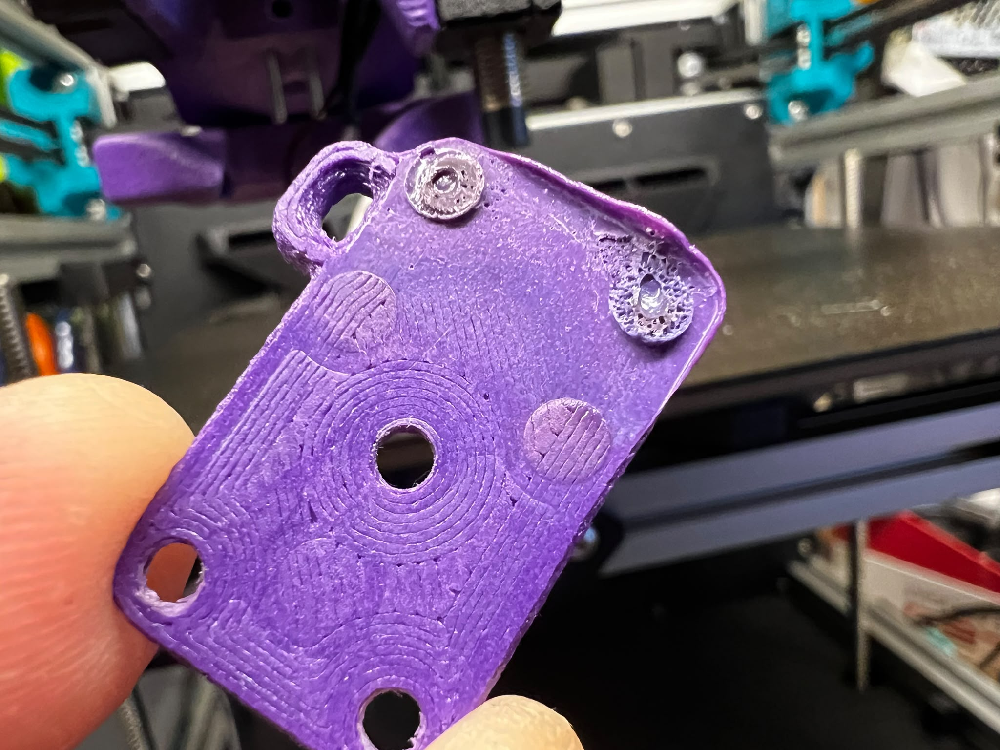
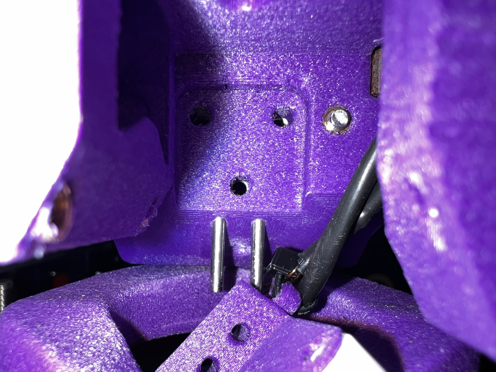
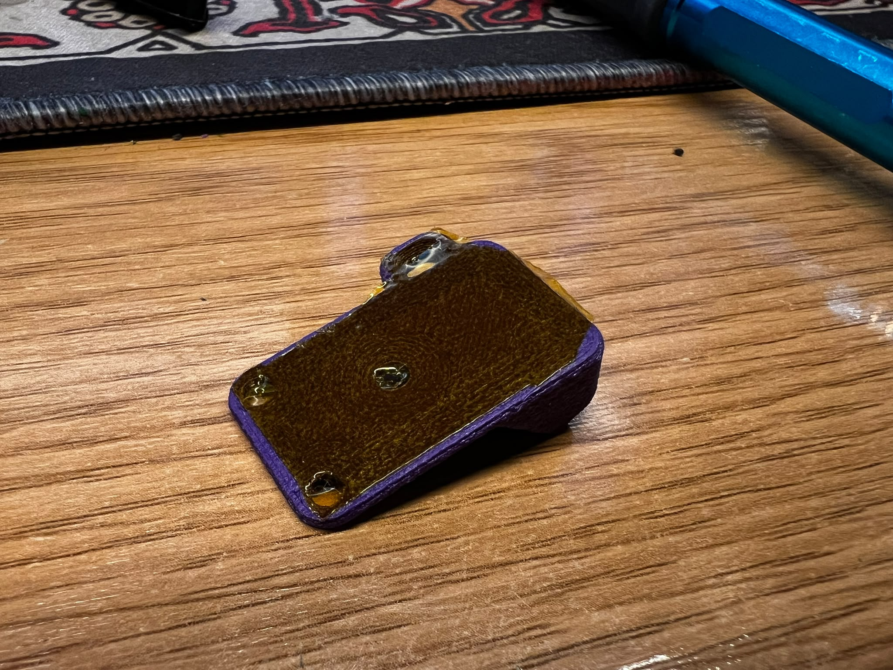
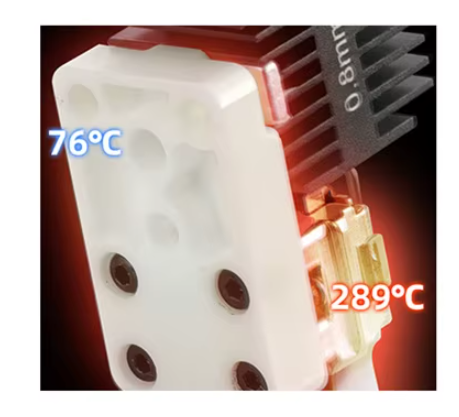
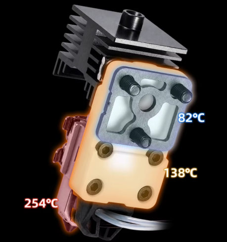
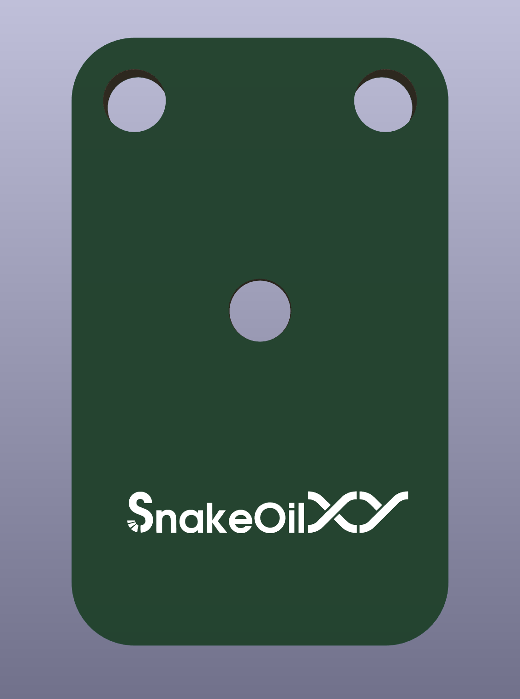

# ProosaXY Bambulab hotend support

The bambulab H2/P2 hotend/nozzles offers a good performance with a competitive price. And we have a bunch of aftermarket for this.

The main idea is to use the A1 heating assembly of aftermarket supplier like mellow or triangle lab.

Both offers Zirconia base plus Cooper block and 96W PTC heater (oem are 48W). Costs around 20-25€

The A1 heating assembly has better wires and known thermistor.

The idea of using H2/P2 nozzles are because they have longer melt distance than the A1 ones.

This idea was impossible to do before due the builtin tensioners, for that reason you need to fit the front belt tensioner mods and a proper X-carrier mod.

This aftermarket heating assembly it's intended to trick bambulab firmware/hardware restrictions that can only deliver 3.5A peak max on heater and later limit to 3A when printing, with this trick they boost the flow rate performance because the limitations made of the standard 48W heater.

We tested with 30mm3/s at 295ºC, the heater was at 50-60% duty cycle.

## IMPORTANT bambulab version

Its intended to fit aftermarket or OEM heating assembly of Bambulab A1, may can work with H2 but not tested. The insulator part need to be printed with heat resistant material, ABS/ASA is not suitable for that piece. The heating assembly has two parts, the hot and the cold, the cold zone has no problem and it's where the mounting screws are fitted, but you need to protect the X-carrier from the heat, the hot zone go really hot.

PC+PBT+GF with HDT of 120ºC melts a bit on hot side, this material is perfect due if you don't anneal its anneal for itself when cooldown. and hold okay without problems.

PA12-CF it's also suitable, made the part of 1mm of thickness to don't have problems with creep. The final version will use a 1mm FR4 PCB, you can also use a universal prototiping board with that thickness and cut by hand. Or whatever you have that insulate with that thickness.

You can use also kapton tape also.

100 Hours of printing filaments at 275-290ºC.

The cold side screws are still thigtened.

The pc+pbt+gf do a great job insulating

You can also add kapton tape. The test was made without kapton tape.

Take in consideration that most of aftermarket developers advertise that even te cold side is hot

## Hotend insulator types

In this section we analyze some of the alternatives.

### Cheap alternative self printed PC+PBT+GF insulator

Unanealed version of this filament can work without problems, the cold side remains with the same thickness, the hot side melts a bit but when cold it self anneal.
Annealed version can work without problems.

### Easy and cheap alternative, PCB insulator

We added a gerber file to buy the pcb on your favorite website. Since it's very cheap we recommend this.

The PCB need to be 1mm thick. 5 pcbs on some website costs 4-5$ with shipping.

### Another easy and cheap alternative.

Just upload the printed insulator and print with SLS/MJF nylon.