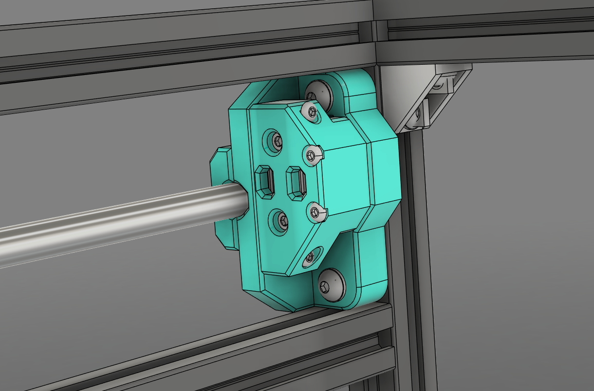
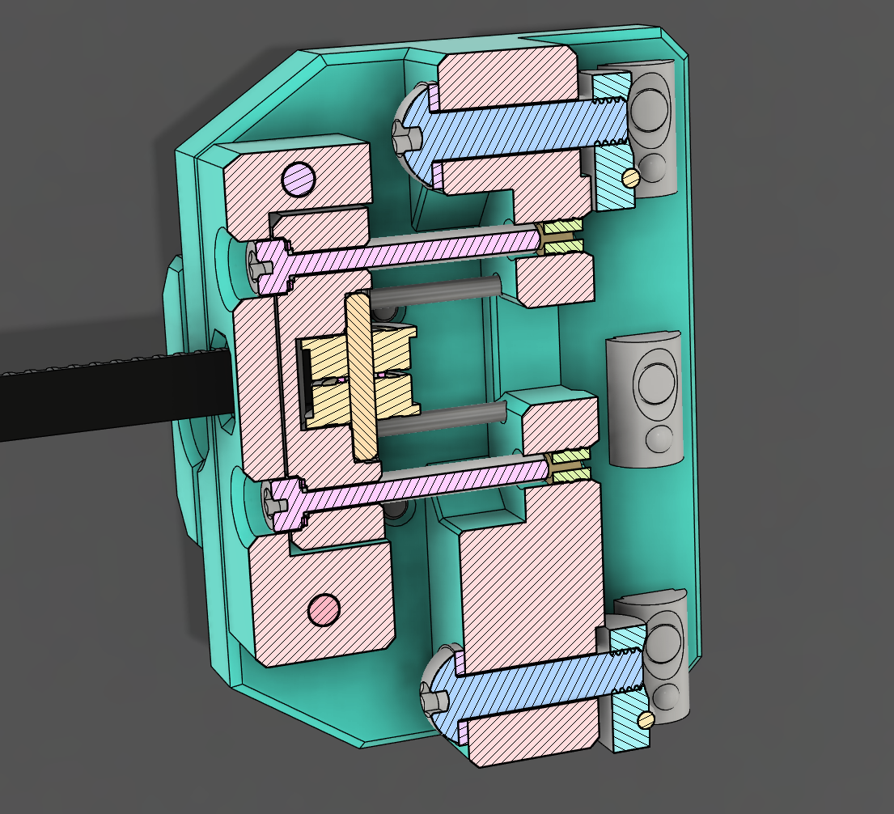
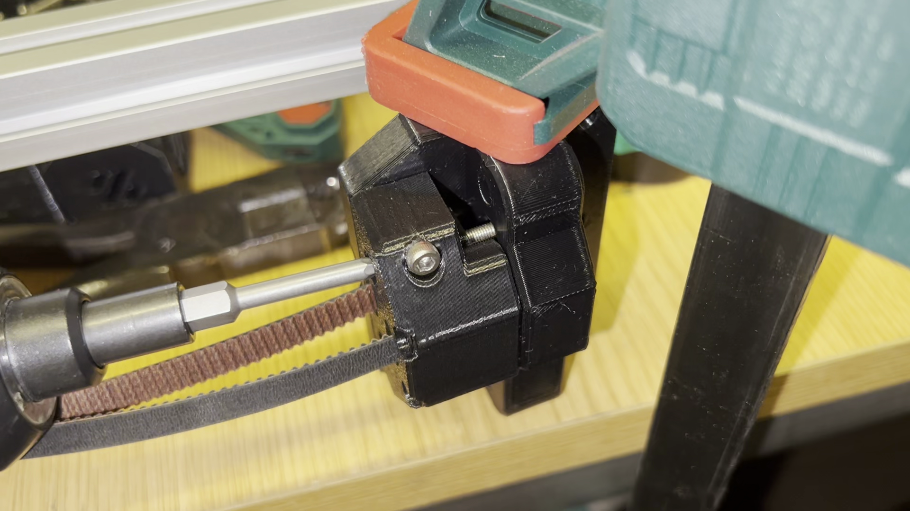
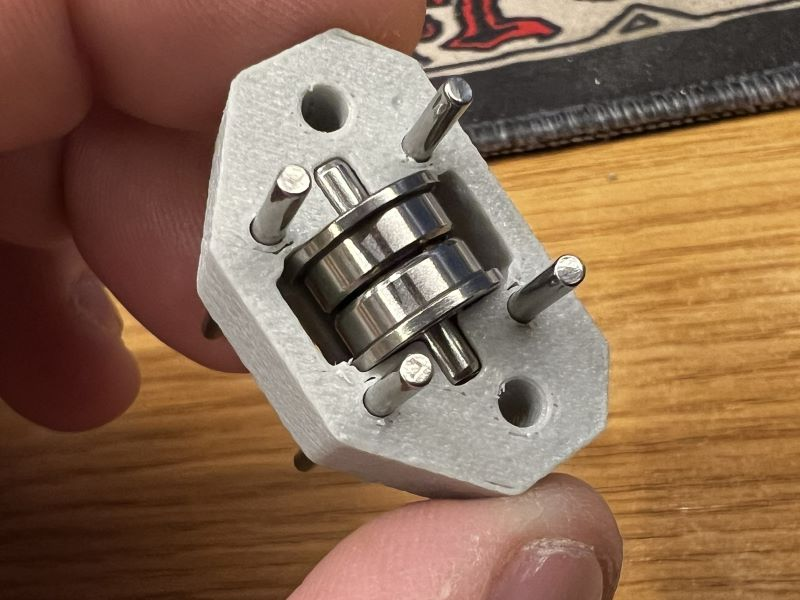

# ProosaXY Front belt tensioners

## 1. Intro

This upgrade is made originally for the ProosaXY HS but can be retrofitted to Stock ProosaXY with 8mm rods if you prefer to use front belt tensioners or maybe you want to fit a custom toolhead

Due it's made originally for the ProosaXY HS that uses 10mm bearings it's 5mm shorter, if you fit with stock 8mm y-carrier you will gain extra 5mm travel on Y, take in consideration an modify your config an add and extra -5mm to Y or use it :)

This compact belt tensioner uses 2mm dowel pins as a guide and features double screws for tension adjustment, in fact you can use only one due the 2mm guides but it's recommended to tighten both to ensure the best reliability. It's capable of 15mm of travel, to use the last 5mm of travel you need to change the screws for others 5mm shorter, because we are using the extrusion pocket to permit the screw protude.

## 1.2. Demo

This is a video of a demo of the belt tensioner and the travel.

## 2. Printing instructions

Use the stock SNAKOIL settings for all parts except the bearing holder, for bearing hoder print solid if you can or at least 7 perimeters with 7 top/bottom layers.

## 3. BOM (for two front belt tensioners)

Here only appears the extra hardware needed, not the full bom.

| Name                 | Units | Notes                                                |
| -------------------- | ----- | ---------------------------------------------------- |
| M3x10 SHSC           | 2     | Replaced one M3x14 SHSC from the y-rod-cap           |
| M3x25 SHSC           | 4     | For belt tensioner itself                            |
| M3x20 BHSC           | 2     | Can be longer but it will protude and will look ugly |
| M3x25 BHSC           | 2     | Can be longer but it will protude and will look ugly |
| M3x30 BHSC           | 4     | Can be longer but it will protude and will look ugly |
| M3x4x4.2 Heat Insert | 12    | Stock ProosaXY heat inserts                          |
| M3x5x0.5 Washer      | 4     |                                                      |
| M2x30 dowel Pin      | 8     | For Belt tensioner guide                             |
| M3x16 dowel pin      | 2     | For bearing stack axle                               |

## 4. Assembly

The design takes in consideration that it's very difficult to have perfect sized small holes, and it's very difficult to have a "universal" clearance for 2 and 3mm holes that needs to be perfect to 3mm or 2mm.

You need to bore up the holes for the 2mm dowel pins and the two 3mm holes for passtru belt tensioner to ensure smooth operation. The dowel pins need to move smooth on belt tensioner.

Then assemble the bearing stack with the 3x16mm dowel pin and click in place.

