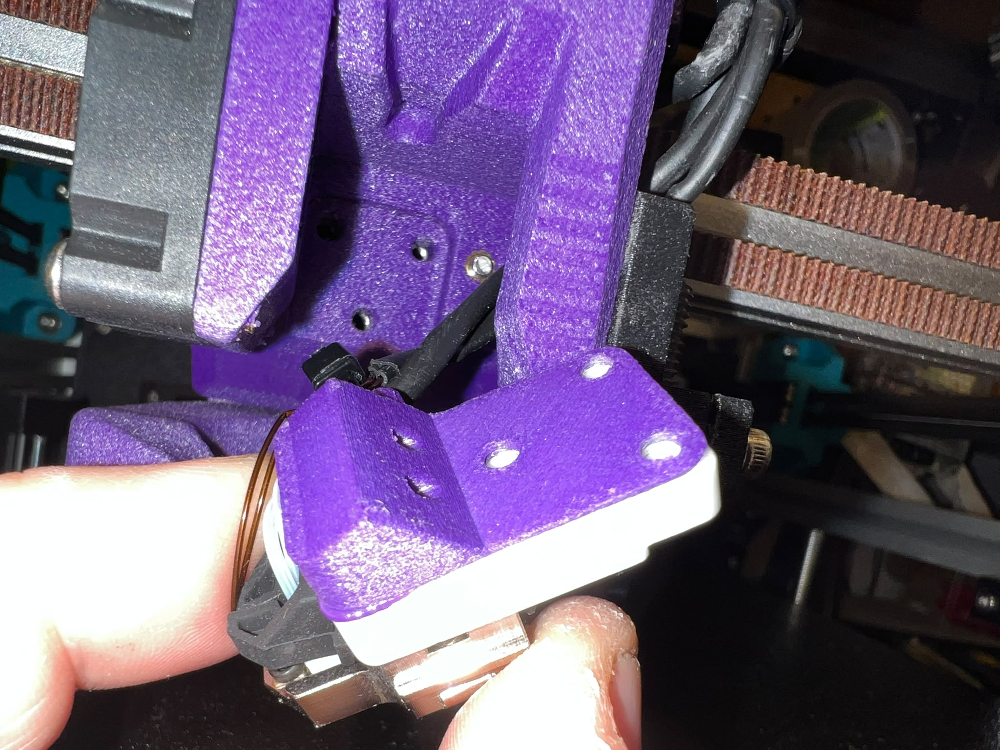

# ProosaXY MGN9H X-carrier toolhead

## IMPORTANT printing instructions

You need to print with 0.15mm layer height all parts and enable supports. Due some organic structures and critical parts it's better to leave this to user. Because some filaments perform different than others on overhangs/z-distance of supports.

## IMPORTANT bambulab version

Its intended to fit aftermarket or OEM heating assembly of Bambulab A1, may can work with H2 but not tested. The insulator part need to be printed with heat resistant material, ABS/ASA is not suitable for that piece. The heating assembly has two parts, the hot and the cold, the cold zone has no problem and it's where the mounting screws are fitted, but you need to protect the X-carrier from the heat, the hot zone go really hot.

PC+PBT+GF with HDT of 120ºC melts a bit, this material is perfect due if you don't anneal its anneal for itself when cooldown. and hold okay without problems.

PA12-CF it's also suitable, made the part of 1mm of thickness to don't have problems with creep. The final version will use a 1mm FR4 PCB, you can also use a universal prototiping board with that thickness and cut by hand. Or whatever you have that insulate with that thickness.

You can use also kapton tape also.

100 Hours of printing filaments at 275-290ºC.

The cold side screws are still thigtened.

The pc+pbt+gf do a great job insulating

You can also add kapton tape. The test was made without kapton tape.

