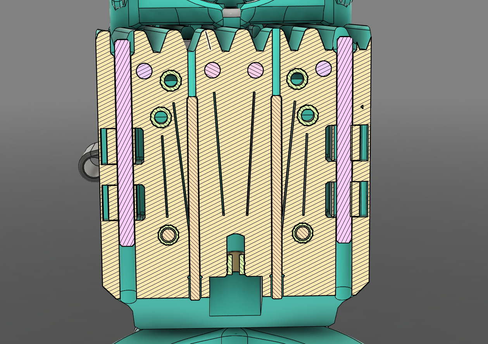
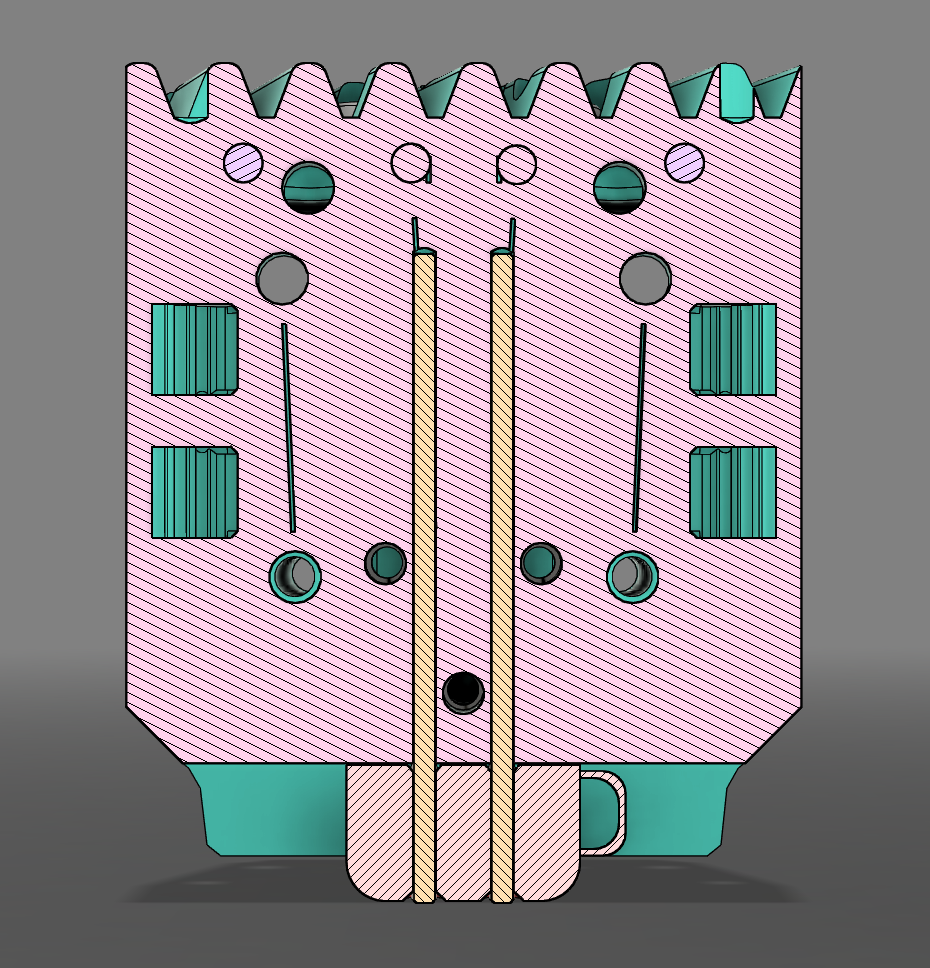
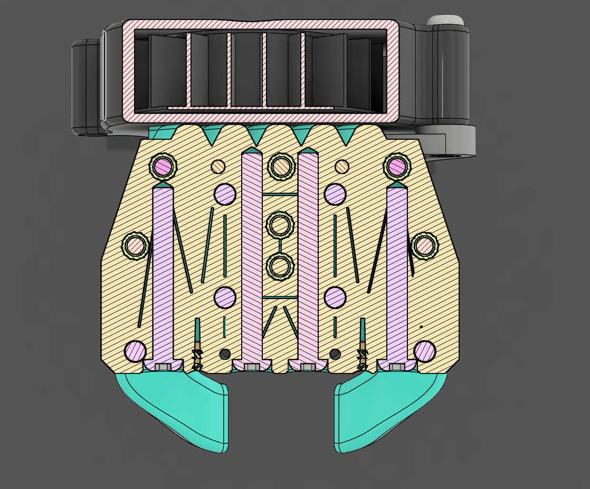
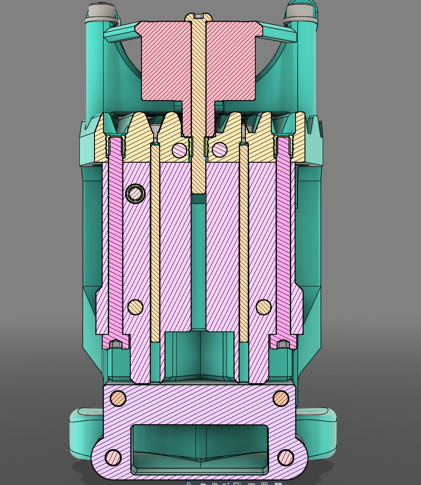

# ProosaXY MGN9H X-carrier toolhead

## Main advantage

With this carrier attached to linear guide instead of round LM8UU bearings you removed a lot of toolhead wiggle on hard accelerations that impact on printing quality at high accels/speeds.

Also have a more easy to fit belts in case of needed to do some maintenance.

It have a motor support to remove the wiggle produced by the weight of the stepper motor, this support it's only compatible with sherpa extruder.

## IMPORTANT printing instructions

You need to print with 0.15mm layer height all parts and enable supports. Due some organic structures and critical parts it's better to leave this to user. Because some filaments perform different than others on overhangs/z-distance of supports.

6-7 walls recomended.

## Compatibility with parts of LM8UU carrier

Except for bambulab version that is have an special carrier, all hotend mounts and extruder mounts of LM8UU are compatible with this, even the fan mounts.

Also the bambulab version can fit hotend mounts designed for LM8UU version, but you can fit the lower part, for example the V6 stabilizer, but we working on design these mounts to fit on bambulab version and maintain only one carrier.

## Reinforcements

Check the cad to see the reinforcements, the dowel pin ones they aren't 100% required but we recomend to install, also the M3 ones gives some support for M3x8 screws that fits the printed piece to the cart. Allowing to thigthen without material creep.

### Main body front

The M3 dowel pins are required to mount the belt clips

The M2x50 ones are not required but ensures a lot of rigidity

The body has slots within the printed piece to enforce more perimeters.

On bambulab version The M2x50 dowel pins are required to ensure rigidity and avoid material creep/loosening the screws.

### Main body top

These reinforcements are mandatory, you can run without but the carrier it's designed to have it.

### Rear part

These reinforcements are not critical, but it's recomended. The top M3x35 screw you can put as long you want, if you have a M3x60 you can fit. It reinforces the printed piece.

## BOM

| Part                 | Quanty | Notes                         |
| -------------------- | ------ | ----------------------------- |
| M2x40 Dowel pin      | 4      | for reinforcements            |
| M3x40 Dowel pin      | 2      | For Belt clip assembly        |
| M3x4x4.2 Heat Insert | 14     | Standard ProosaXY heat insert |
| M3x10 BHCS           | 2      |                               |
| M3x25 BHCS           | 2      | for reinforcements            |
| M3x30 BHCS           | 2      | for reinforcements            |
| M3x35 BHCS           | 3      |                               |
| M3x8 SHCS            | 4      | For MGN9H fixing              |
| M3x10 SHCS           | 2      | For motor support             |
| M3x16 SHCS           | 2      | For fan support               |
| M3x20 SHCS           | 2      | For motor support             |
| M3x40 SHCS           | 2      | For rear support              |
| M3x3x7 Washer        | 4      |                               |
