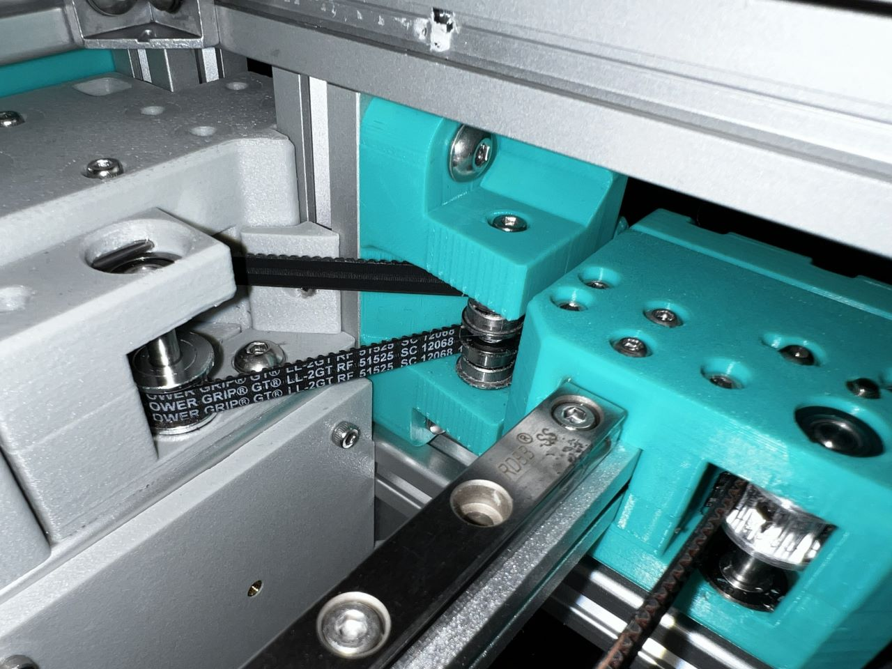
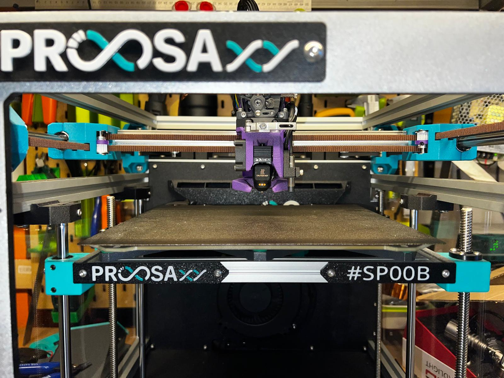

# ProosaXY MGN9H X axis

This mod is intended to fit 1515 Alu Extrusion with MGN9 linear guide with H Cart.

Developed for ProosaHS but made the retrofit with LM8UU version, because the MGN9H toolhead improves A LOT the print quality when go with some accels and things speeds up a little. Because eliminates most of the toolhead wiggle.

## Upgrade Path

### ProosaXY maintaining LM8UU Y-axis

You need to install the following mods

* Front belt tensioners
* Short rear rod holders (included on this mod)
* Following BOM (we are reusing some screws from normal proosa)

| Part                    | Quanty | Notes                                                                         |
| ----------------------- | ------ | ----------------------------------------------------------------------------- |
| 1515 Aluminum extrusion | 1      | 350mm for ProosaXY , 288mm for Proosa Mini, need to be misumi or Makerbeam XL |
| MGN9H                   | 1      | 305mm for ProosaXY , 244mm for Proosa Mini.                                   |
| M3x8 SHCS               | 8      | For the MGN9 linear guide assembly                                            |
| M3x14 SHCS              | 12     | Reused from ProosaXY                                                          |
| M3x30 SHCS              | 10     | Can be BHCS                                                                   |
| M3x12 BHCS              | 8      | Can be SHCS                                                                   |
| M3 Square nut           | 18     |                                                                               |
| M3x4x4.2 Heat Insert    | 22     | Standard ProosaXY heat insert                                                 |
| M3x16 Dowel pin         | 2      |                                                                               |
| F623RS Flange Bearing   | 4      | Reused from ProosaXY                                                          |
| M3x5x0.5 Washer         | 2      | Reused from ProosaXY                                                          |
| 2x LM8UU Linear bearing | 4      | Reused from ProosaXY                                                          |

For narrow version (Halved 2mm), that allows to move the bed to the left 4mm and able to nozzle go outside the bed easy for purge bucket and others

| Part                      | Quanty | Notes                                      |
| ------------------------- | ------ | ------------------------------------------ |
| M5x30 BHCS                | 2      |                                            |
| 20T 2GT Gates style idler | 2      | 10mm tall, 15mm OD , check CAD for details |
| M5x7x0.5 Washer           | 4      |                                            |

For standard version.

| Part                               | Quanty | Notes                                                   |
| ---------------------------------- | ------ | ------------------------------------------------------- |
| M5x30 BHCS                         | 2      |                                                         |
| 20T 2GT 8.5mm height toothed idler | 2      | You may will reuse this if you already have the 20T mod |

For Live idler version

| Part                  | Quanty | Notes                                                                                                                                                                                                                                                                             |
| --------------------- | ------ | --------------------------------------------------------------------------------------------------------------------------------------------------------------------------------------------------------------------------------------------------------------------------------- |
| M5x30 Dowel pin       | 2      |                                                                                                                                                                                                                                                                                   |
| F695 Flanged bearing  | 4      |                                                                                                                                                                                                                                                                                   |
| M5x7x0.5 Washer       | 4      |                                                                                                                                                                                                                                                                                   |
| M3x5x7 Washer         | 4      |                                                                                                                                                                                                                                                                                   |
| M3x4x4.2 Heat Insert  | 8      |                                                                                                                                                                                                                                                                                   |
| M3x6 BHSC             | 4      |                                                                                                                                                                                                                                                                                   |
| M3x8 grub             | 4      | You can use also a normal screw but will protude and makes the printer ugly                                                                                                                                                                                                       |
| 20T AF Pulley / dehub | 2      | You can use dehubbed 20T pulley, you need to sand a bit the screws to make shorter, to not rub with the other belt,  also you can use AF style pulley if it comes with M2.5/M2 grub screw, the ones with M3 screw may damage the belt on time. You can also use press fit pulley. |

### ProosaXY Upgrading to 10mm rods on Y axis or Proosa Mini

The same of live idler LM8UU upgrade path but printing the 10mm parts.

Check your bearing type, if you are upgrading from Proosa Mini that comes with LM10LUU you need to print the LM10LUU parts, if not we recomend to buy LM10UU bearings.

You will need 4.
