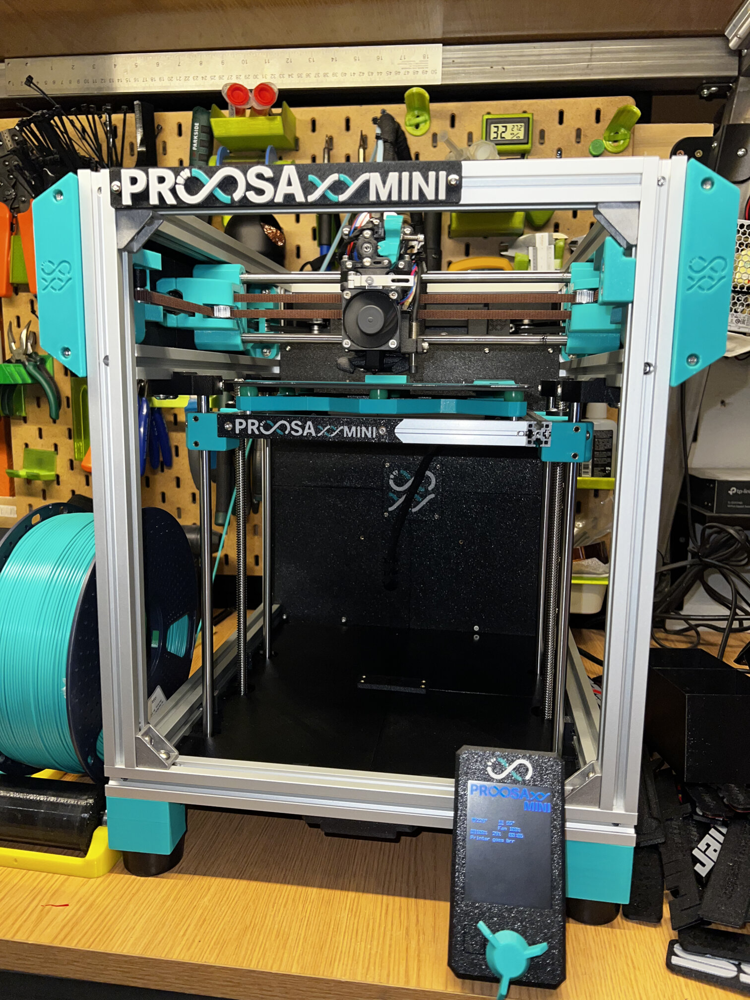
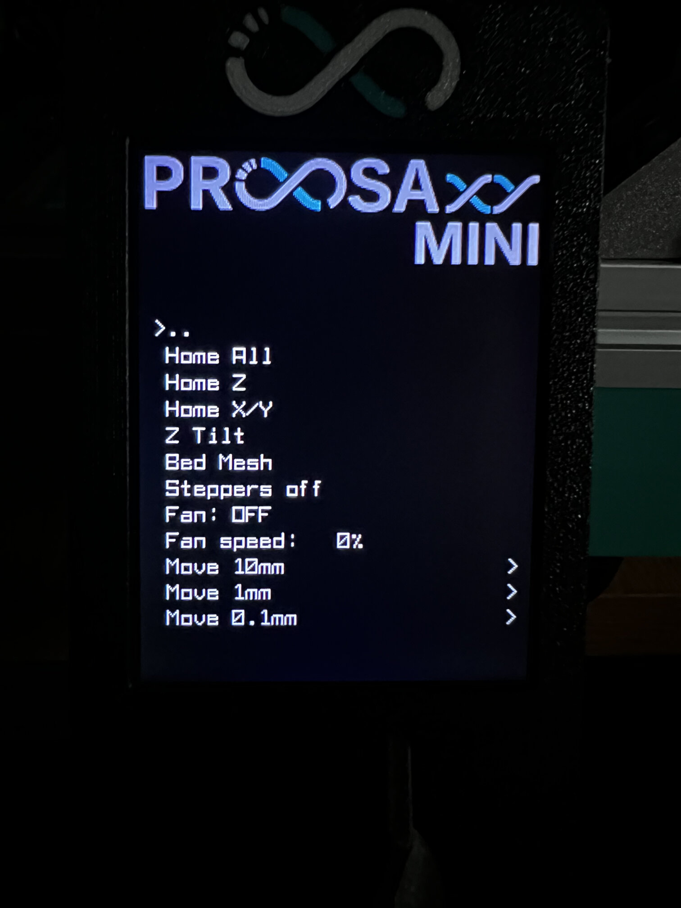
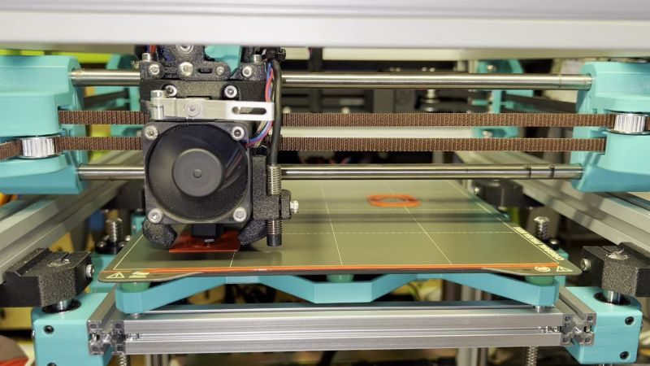
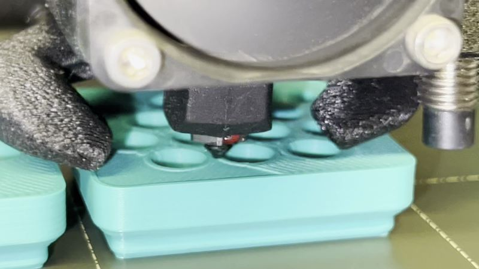
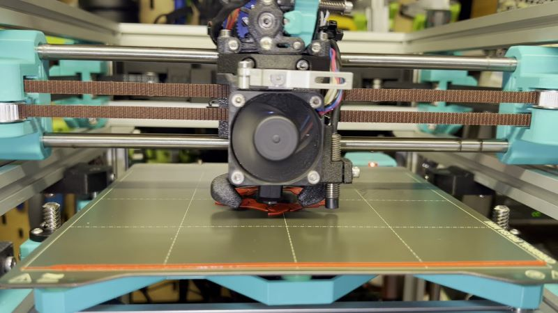
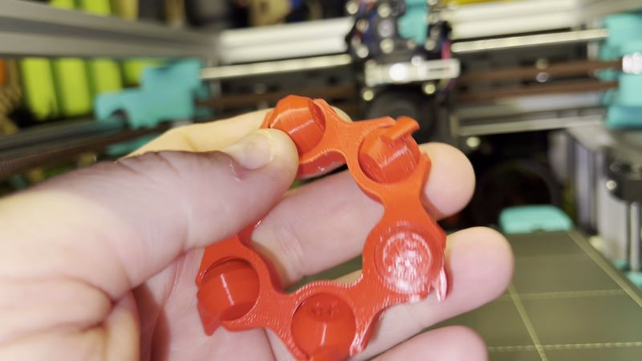
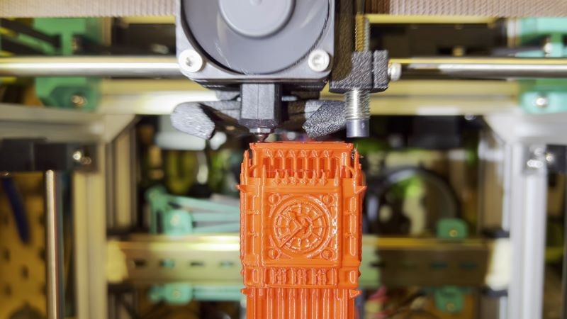
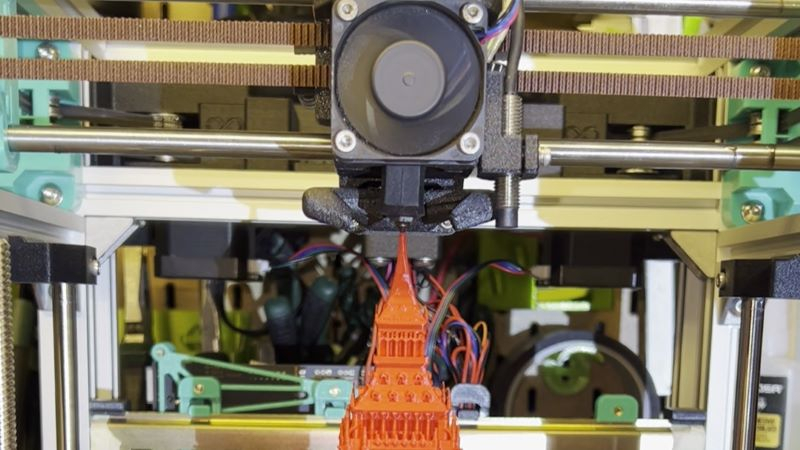
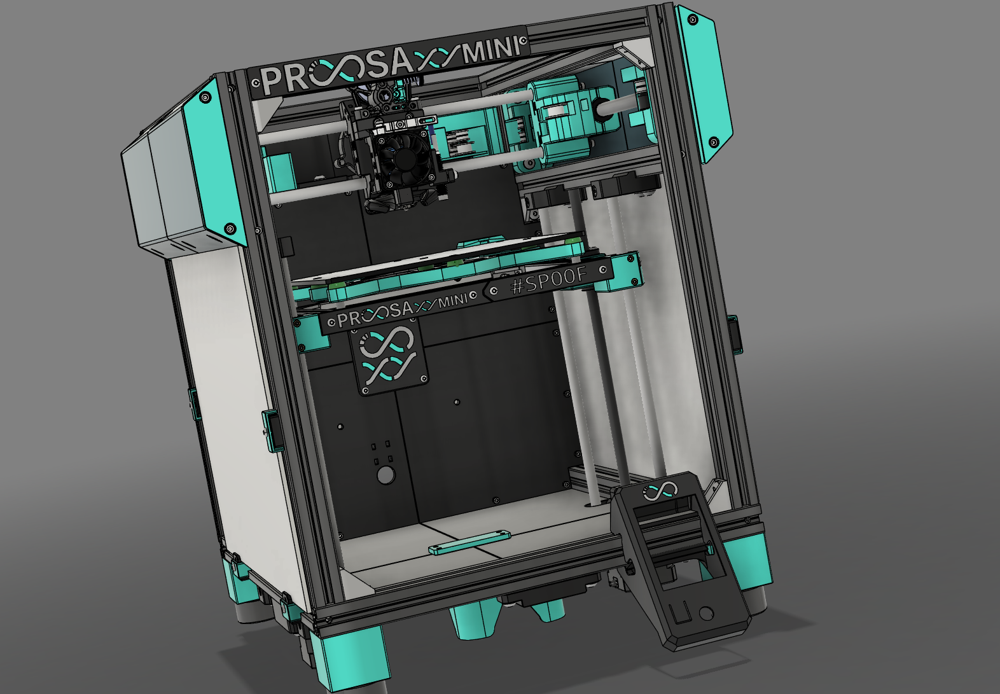

# ProosaXY MINI

This is the MINI version of ProosaXY using a Prusa MINI as a donor. Transforming your old printer on a beast with multicolour print capable if you want reusing most of the stock parts.

## 1. Features

- Better performance printing at 150/300mm/s 15/20K and 600mm/s-40k for travels.
- Semi-enclosure by default. Panels mount and top hat parts will be added later.
- Dual Z axis with independent drivers. (No more skew) with Z-tilt
- 180x180x210 build volume (You can use even 200x200x210 if the base of the print fits within 180x180 print surface.
- MMU capable (tradrack support)
- Semi-enclosured(default) or Fully-enclosured with top hat(comming soon).
- Our industrial leading SnakeOil technology :).

## 2. Warning - read this

- This mod requires cutting the original motor leadscrew, and linear shafts. This utting is easy enough to be done with hacksaw or other tools**BUT THERE IS NO WAY BACK. You won't be able to convert back to the original MINI machine if you change your mind later.**

## 3. Test run videos and images

### 3.1 Images

 

### 3.2 Videos

Printing random things

 

Printing clearance test.

 

Printing tall object (full height)

 

### 3.3 Printing settings

The printing settings of the videos are the following. Intended for fast-quality prints.

*Note: This settings are with OMC HE19 Steppers running at 1amp.*

**Speeds**

* 150mm/s External walls
* 250mm/s internal walls
* 300mm/s solid infill
* 350mm/s low dense infill
* 80mm/s top infill
* 600mm/s travel

**Accels**

* 15K default
* 10K external walls
* 20K internal walls
* 25K infill
* 5K top infill
* 40K travels

**Jerk/SCV**

* 15mm/s default
* 15mm/s external walls
* 20mm/s internal walls
* 30mm/s infill
* 10mm/s solid infill
* 40mm/s travel

Only Z-hop on top surfaces

### 3.4 Build your own Proosa XY :)

Check README on doc folder.
The bom is located here: [ BOM (GOOGLE DOCS), check Proosa Mini tab](https://docs.google.com/spreadsheets/d/1j1bnA8rNjDqpTVEdiqrsRlNeggI6PYRAoSBm1F8bvCs/edit?gid=1180102657#gid=1180102657)

Check the CAD file under src/step section :)

</a>
