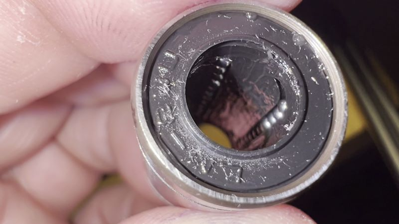
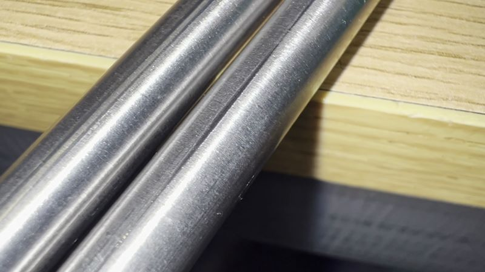
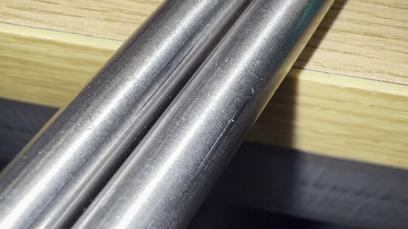
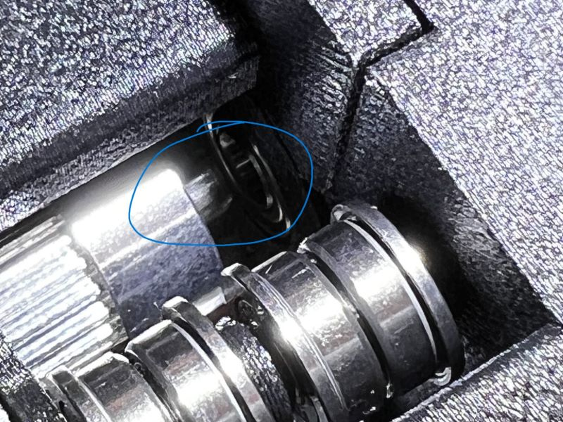

# ProosaXY Mini build

## 1. FAQ

* Love this build but.... I need a Mini to make this build?

No, indeed, on some circunstances it's better to self source instead of buying a Mini to do this mod. If you have already a Mini or you find a cheap Mini you can use as a donor :)

The only part that is a bit difficult to source is the heated bed, you can buy a brand new one on Aliexpress.

* Where is the complete assembly guide of this printer?

Like the ProosaXY no guide available, only the step file of the standard ProosaXY and the discord, we put some help on this repo, but you are welcome to our discord :)

* There is no kit available like the ProosaXY ?

At this moment no. You will need to source all by yourself, we recommended to buy the extrusions already cutted and you only make the drills and taps.

* Where is the Step file of the ProosaXY Mini?

At this moment to avoid to delay the release to much we don't have at the moment, our team it's very small. But you can use instead the step file of the standard ProosaXY, this printer is essentially a small version of ProosaXY with minor differences.

## 2. BOM

The bom is located here: [ BOM (GOOGLE DOCS), check Proosa Mini tab](https://docs.google.com/spreadsheets/d/1j1bnA8rNjDqpTVEdiqrsRlNeggI6PYRAoSBm1F8bvCs/edit?gid=1180102657#gid=1180102657)

### 2.1 Optional upgrades / options

#### 2.1.1 TR8x4 vs TR8x8 lead screw

The Mini uses TR8x4 lead screw to avoid to push to much the Z stepper holding the X-axis, you need to pair with another TR8x4, on our experience Prusa often uses a slighty different pitch on some of their Z steppers, you can pair without problems with other Z stepper of Mini but a standard TR8X4 lead screw is not tested, the #SP00F proosa it's built using two brand new TR8x8 steppers.

#### 2.1.2 Fresh LM8UU bearings

Why need to buy 3 LM8UU bearings if only need 2 ? Unless your mini comes with Misumi bearings... if your mini comes with noname bearings, put fresh new bearings. Trust me.

Stuck row of balls with missing ones.

Smooth rods destroyed, you can also reuse if you rotate to avoid the scores on the rod.

#### 2.1.3 Better X/Y motors

Stock steppers of Mini comes from the old reliable MK3S, very high inductance, very good to run with very low current with good torque on very low speeds and accels, very bad for high speed applications.

If you want to go further with stock steppers you need to know the current limit its about 0.6-0.65 amps and some printing accels/speeds [based on my old Klippericed MK3s bedslinger](https://www.youtube.com/watch?v=eHqDQD0xJSYhttps:/)

* External walls 3K / 140mm/s / 5mm/s SCV
* Internal walls 5K / 140mm/s / 7mm/s SCV
* Low density infill 8K / 200mm/s / 9mm/s SCV
* Solid infill 8K / 200mm/s / 9mm/s SCV
* Top surfaces 3K / 80mm/s / 9mm/s SCV
* travel 8K / 350mm/s / 12mm/s SCV
* Stepper motors horny like hell (expect 80-85ºC)

Yeah it's not that bad when you comes from 1-2K accels and poor speeds but...it's a 20€ upgrade that makes huge difference.

Otherwise, the stock steppers can't go double sheared, expect internal bearing failure over time with these heat + speeds + accels.

#### 2.1.4 8mm linear shaft

You need H6 or better tolerance shafts. AKA, the rod needs to measure at minimum 7.991mm , if the rod measure below these dimension the bearing will not fit very well and you will have problems of internal play. Some aliexpress vendors sell 7.970mm rods that are completelly out of tolerance.

That one of the bom from aliexpress has H4 tolerance, -0.003 (7.997mm), the one of Europe location has H5 tolerance even if the seller says H6, bought and measured and has -0.005 (7.995mm)

The rod needs to be hardened to avoid the wear.

#### 2.1.5 Hotend

We don't support the Mini hotend, it are prone to heatcreep, because the lack of real heatbreak, also have a very low flow rate. You have some mounts for these toolhead.

The bang for buck option is the TZ-V6 2.0, the 2.0 version have M6 thread and you can fit V6 standard nozzles. With good non-cht noozle you can have 22-23mm3/s flow rate all-aroud and peak 25mm3/s for low density infills. This is about 280-350mm/s printing speed.

The TZ-V6 2.0 works very good with MMU.

## 3. Things to do

1. Read the BOM
2. Buy the parts
3. Use the ProosaXY step file to check assembly, read on discord the buildlogs
4. Read the bed assembly doc, it's important
5. Read the 20T idler assembly doc, it's different from normal proosaXy
6. Read the Z axis assembly doc, the procedure is also on discord server
7. Read the flash buddy doc, requires an extra step to do
8. Read the display config doc, it's required to do the modifications on your klipper files to able the use of the OEM LCD, if you don't want to use you can skip and put the LCD of your preference or klipperscreen.
9. The klipper config doc explains the connections of the provided config files, and how to grab +24V and GND from stock buddy board.
