# ProosaXY Mini bed assembly

## 1. Intro

Unlike the MK3S the bed frame on the mini doesn't have threaded holes for 9 screw assembly.

Instead it use standoffs and very small m3 counter sunk screws.

This is not very convinient if you want to print PETG or even ABS if you enclose the printer, because the bed will bend like a taco. Even if you don't want to print with high temperature bed, your bed frame could be warped because an accidental hit.

For that reason we will use the silicon mod to assemble the bed pcb to the frame and then to the extrusions.

## 2. Check the screws first

Te typical FHCS screws doesn't sit flat on MINI bed.

<a href=assets/20260423_011417_IMG_7444.jpg>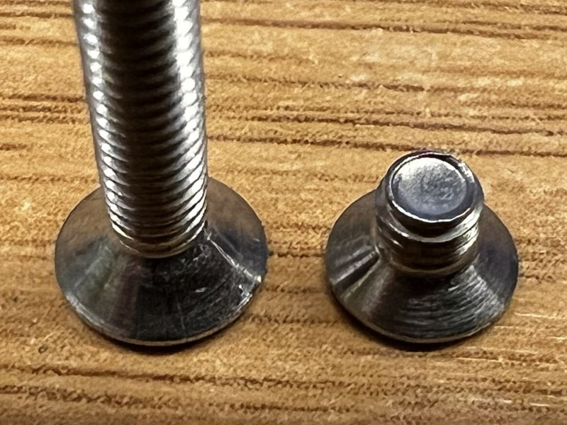</a> <a href=assets/20260423_011417_IMG_7446.jpg>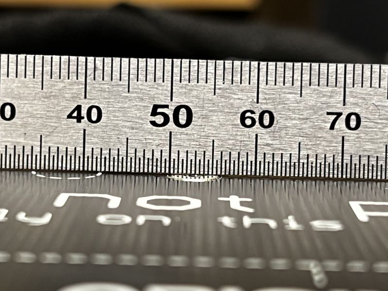</a>

You can use a drill and a file to sand down the screw on the top part and the circunference.

You can check on this photos the difference.

<a href=assets/20260423_011733_IMG_7455.jpg>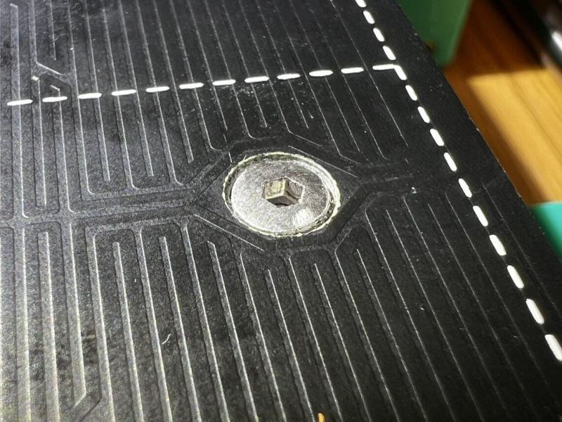</a> <a href=assets/20260423_011733_IMG_7456.jpg>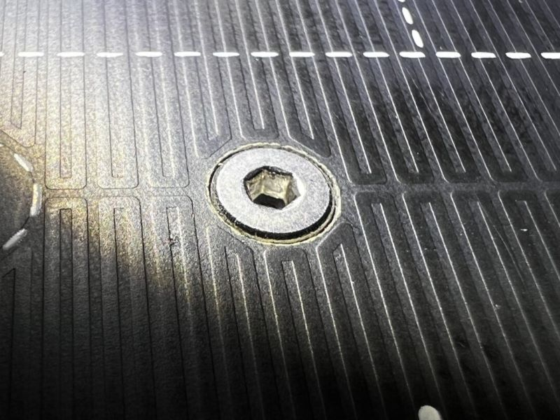</a>

### 2.1 Screw sizes, nuts and spacers

You need:

* x4 M3x25 FHCS for the corners
* x5 M3x18 FHCS for the rest
* x3 M3x10 BHCS/SHCS
* x5 nylock nuts
* x4 6x6x3 metal spacers, (the same of the MK3S bed)

## 3. Bed frame position

Assemble the frame and the pom nut holders/lm8uu holders.

The bed frame will be mounted on the far left side, leaving space on the right to able the nozzle go outside the bed.

<a href=assets/20260423_012025_IMG_7429.jpg>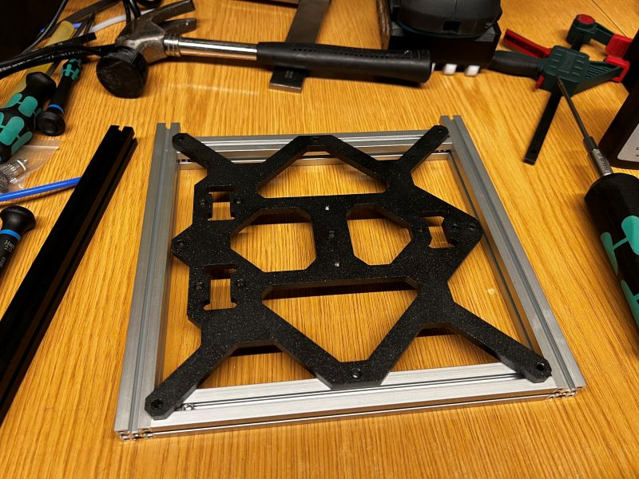</a> <a href=assets/20260423_012025_IMG_7430.jpg>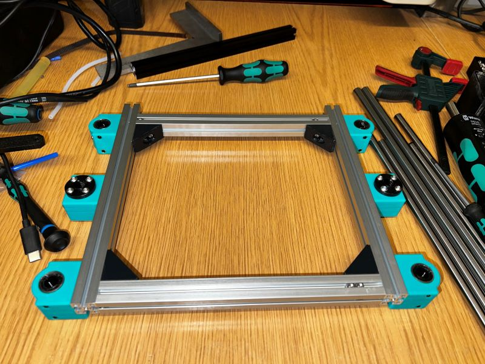</a>

## 4. Bed helper

This is not mandatory but it's 100% recommended, due this able to hold the nyloc nuts in place to adjust the silicon mod, and makes easy the installation on the extrusions without needing to hold by hand the bed spacers.

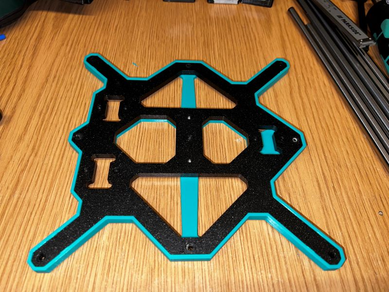

Assemble like this photo, don't forget to put the silicon tubes before on each screw.

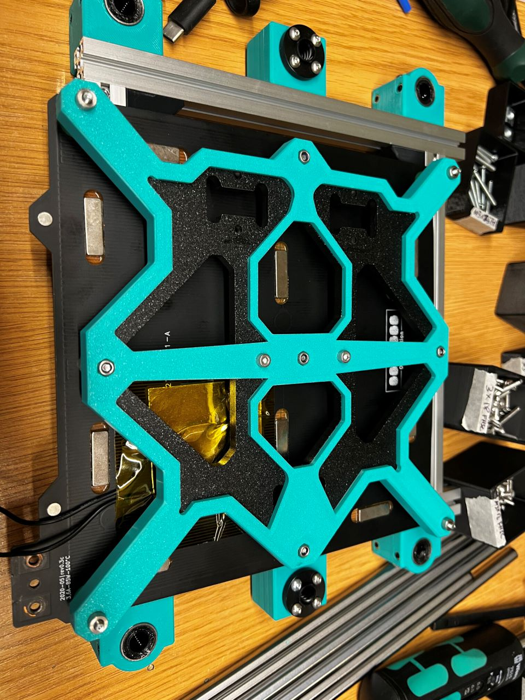

With the bed helper this task is easy peasy.

<a href=assets/20260423_013308_IMG_7443.jpg>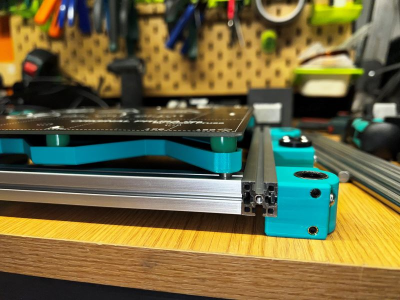</a> <a href=assets/20260423_013308_IMG_7440.jpg>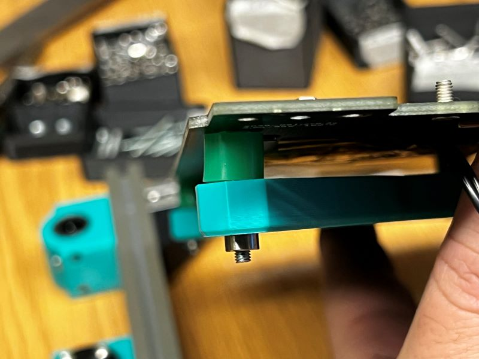</a>

You can use a ruler to eyeball adjust the bed, but you can adjust later.

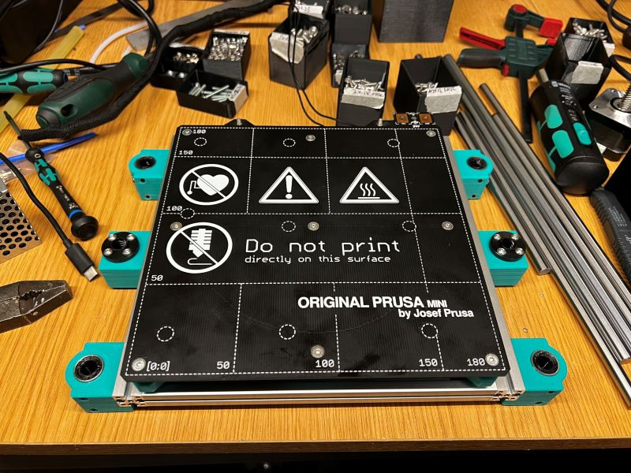

## 5. Print surface stoppers

This screws that are used to hold the plate in place are too long and will scrub your print fan shroud, on MK3S it are 3.2mm tall, on mini are 4.2mm tall, you need to trim a bit with a file.

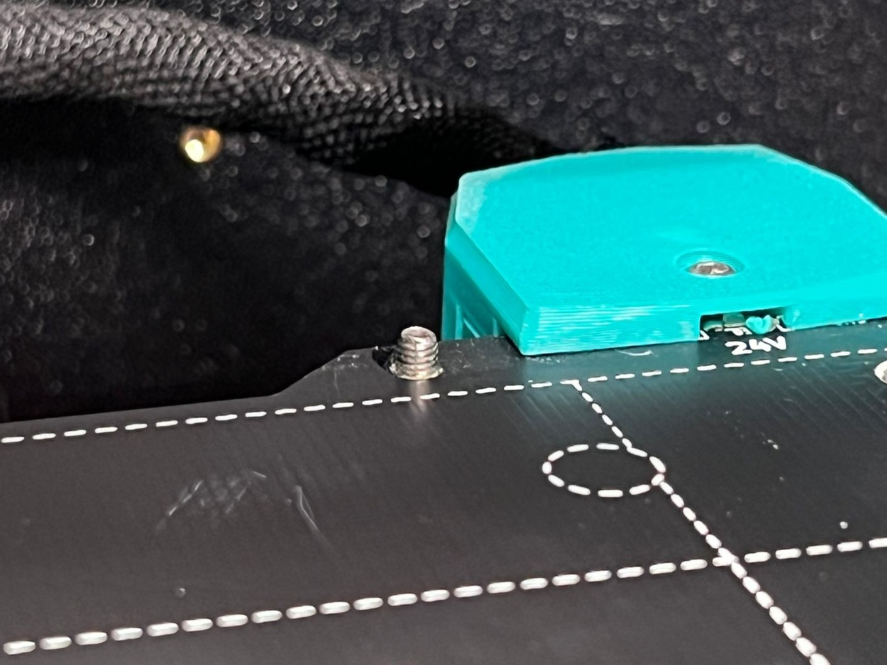
