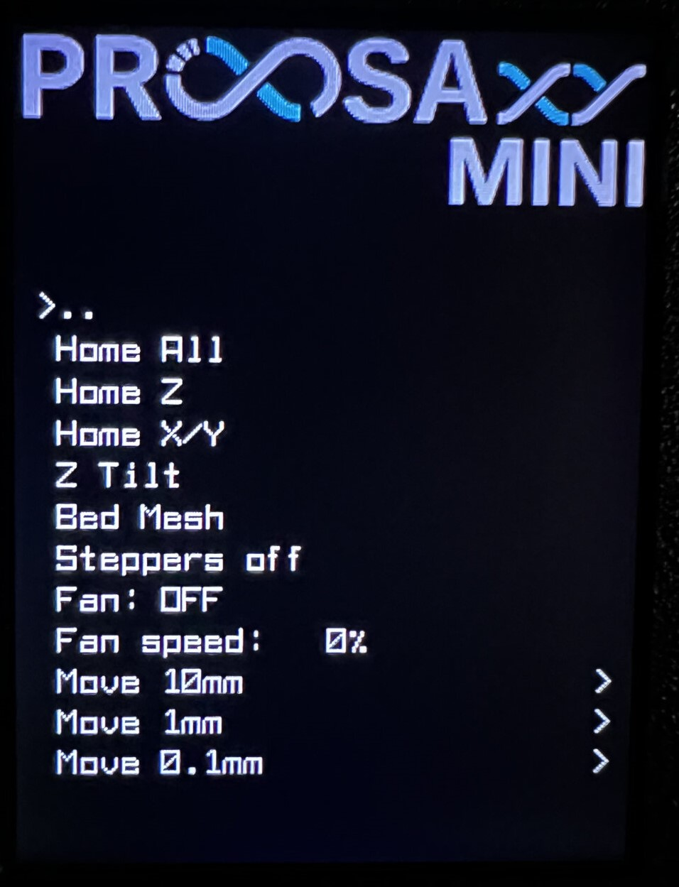
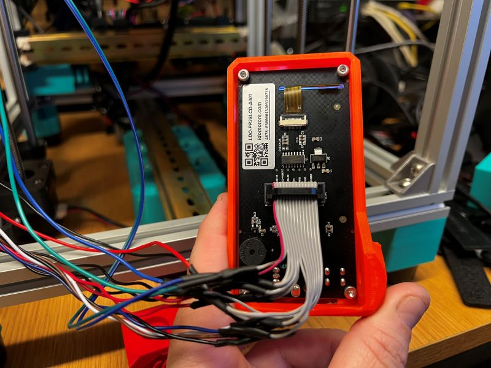
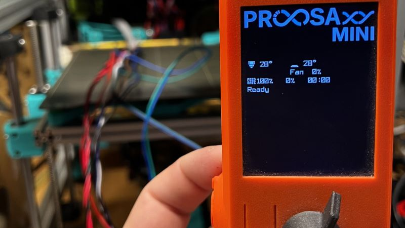

# ProosaXY MINI OEM LCD config

This is a small step-by-step guide to configure the Prusa Mini stock LCD on klipper.

Klipper doesn't support by default the screen, this is based on this [old fork](https://github.com/singh-gur/mini_klipper), the problem of these fork is no longer maintained, and you can't update klipper version because it breaks, the module itself is outdated and can't run on an actual mainsail installation because the different python versions, most of the code uses deprecated functions.

This is a complete rework, installing and configuring only the necesary, you can update klipper but you will need to apply these changes again, I tried to optimize the code a bit the screen runs a bit slow, but is usable.

## 1. Configuring the system

This guide is made using as a host a standard mainsail installation from raspberry pi.

We need to access via SSH to our mainsail installation

```bash
ssh -l user mainsailos.local
```

We need to install within the klippy-env of klipper some modules

```bash
source ~/klippy-env/bin/activate
pip install pillow st7789
deactivate
```

Now we are going to edit the following file ~/klipper/klippy/extras/display/display.py on two places.

We are going to add at the ending of the line of imports **st7789v**

```python
# This file may be distributed under the terms of the GNU GPLv3 license.
import logging, os, ast
from . import aip31068_spi, hd44780, hd44780_spi, st7920, uc1701, menu, st7789v

```

Locate this part, then add 'st7789v': st7789v.ST7789V like the code below, don't forget the comma at the end of aip31068_spi,

```python
LCD_chips = {
    'st7920': st7920.ST7920, 'emulated_st7920': st7920.EmulatedST7920,
    'hd44780': hd44780.HD44780, 'uc1701': uc1701.UC1701,
    'ssd1306': uc1701.SSD1306, 'sh1106': uc1701.SH1106,
    'hd44780_spi': hd44780_spi.hd44780_spi,
    'aip31068_spi':aip31068_spi.aip31068_spi,
    'st7789v': st7789v.ST7789V
}
```

Copy the following files to ~/klipper/klippy/extras/display/

* st7789v.py
* logo.py
* logo.png

This files are under config/display section.

## 2. Cool font

If you want a cool font to change the booring standard font you can copy the file font8x14.py of config/display section to the path ~/klipper/klippy/extras/display/, [original author.](https://github.com/Klipper3d/klipper/issues/1564#issuecomment-487075600)

<p style="text-align:center;">
<a href=assets/20260424_202315_new_font-small.jpg></a>
</p>

## 3. Display wires need to be longer

You need to lengthen the cables by about 45-50cm, no problems with SPI communication.

<p style="text-align:center;">
<a href=assets/20260424_202934_IMG_7539.jpg></a> <a href=assets/20260424_202934_IMG_7538.jpg></a>
</p>
