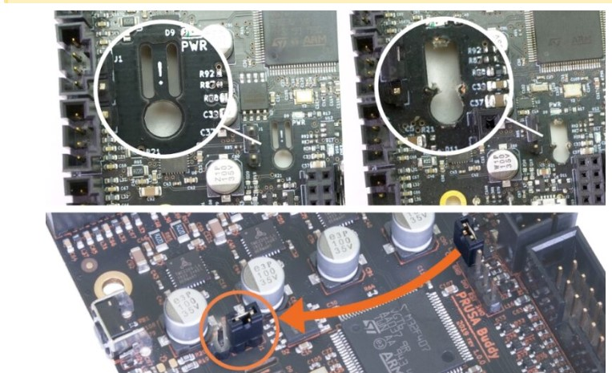

# Buddy board flash

**In order to use with klipper we need to flash klipper firmware on our Buddy board. But you can do straight because Prusa protected to write unsigned firmwares on his board. To do this you need to break the appendix seal of your board or removing a jumper depending of your version of board.**

[Flashing-custom-firmware-mini](https://help.prusa3d.com/article/flashing-custom-firmware-mini-mini_14https:/)

You can flash back with prusa software, but the appendix won't grow back.

This guide is made for MainsailOS.

## 1. Compile klipper firmware

SSH to your MainsailOS install and generate the config to compile

```bash
cd ~/klipper/
make menuconfig
```

Then input the following options:

* Check Enable extra low-level configuration options
* set Microcontroller Architecture to STMicroelectronics STM32F407
* Bootloader offset to 128KiB + 512 Byte offset
* set clock reference to 12Mhz Crystal
* Set Communication interface to USB (on PA11/PA12)

Then save and exit.

Disconnect everything of your Buddy board, leaving only the power button, the LCD, the PSU and the USB connected to our MainsailOS machine.

We now are going to put the board in DFU mode,you don't need to put the jumper, just short and power on the board, the LCD screen goes white instead to load the Prusa bootloader, if the board shows the prusa mini logo you aren't in DFU mode, the LCD screen needs to be white.



When you are in DFU mode now list the USB devices to check the usb ID.

```bash
lsusb
....
....
Bus 001 Device 010: ID 0483:df11 STMicroelectronics STM Device in DFU Mode
....
....

```
If you don't see this, check your USB connection.

Now we need to flash the board with new firmware, but you cant with the dfu-utils available within this version of MainsailOS/Debian because are too new, and you can't downgrade via package, you need to download the dfu-utils-0.9 source code and compile, we need to remove first the actual dfu-utils version if installed.

```bash
sudo apt remove dfu-util
sudo apt install build-essential libusb-1.0-0-dev pkg-config
curl https://dfu-util.sourceforge.net/releases/dfu-util-0.9.tar.gz --output dfu09.tar.gz
tar -xvf dfu09.tar.gz dfu-util-0.9/
cd dfu-util-0.9
./configure
make
sudo make install
dfu-util --version
```

If you struggle with this we uploaded the dfu-util-0.9 compiled for this OS. Check doc/config/dfu-util on this repo.

With the correct version of dfu-util on our system we can flash now

```bash
sudo dfu-util -a 0 -D ~/klipper/out/klipper.bin
```

You will se some erros, it's okay. Now reset the board and check again the usb devices.

```bash
lsusb
...
...
Bus 001 Device 005: ID 1d50:614e OpenMoko, Inc. stm32f407xx
...
...
```
You will see now the buddy board correctly and now you can see the device available for serial communication.

```bash
ls /dev/serial/by-id/
usb-Klipper_stm32f407xx_56003A001150315239353820-if00
```
Congratulations you have now your buddy board with klipper firmware.