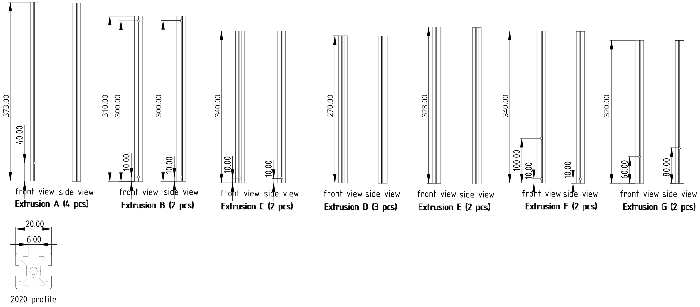
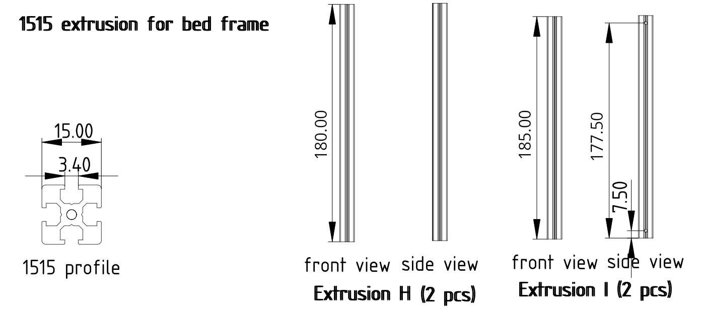
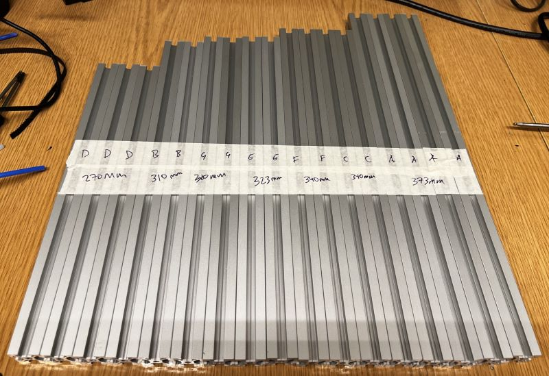
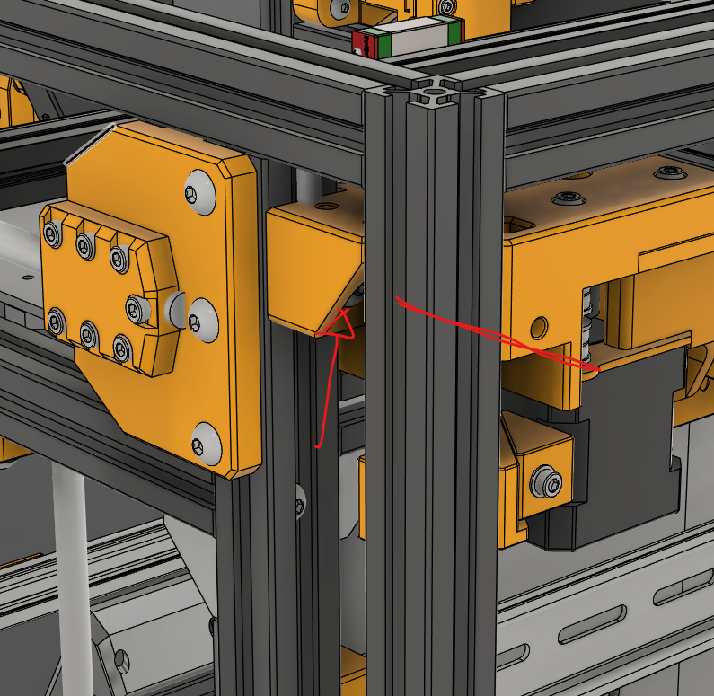

# ProosaXY MINI Frame extrusions

This document is recycled from ProosaXY, some extrusions are not at correct scale. The extrusions of proosa mini are the same types/letters but some extrusions differ on lenght

| Extrusion | Lenght | Number | Notes                                                                                                                   |
| ----------- | -------- | -------- | ------------------------------------------------------------------------------------------------------------------------- |
| A         | 373    | 4      |                                                                                                                         |
| B         | 310    | 2      |                                                                                                                         |
| C         | 340    | 2      | You may want to make a hole at 45mm to have a hole to remove the motor mounts without remove an extrusion.              |
| D         | 270    | 3      |                                                                                                                         |
| E         | 323    | 2      |                                                                                                                         |
| F         | 340    | 2      |                                                                                                                         |
| G         | 320    | 2      |                                                                                                                         |
| H         | 180    | 2      |                                                                                                                         |
| I         | 185    | 2      | This extrusion can be 200mm if you want to save some money on cuts. But you need to take in consideration for the holes |

## Extrusion C Hole

