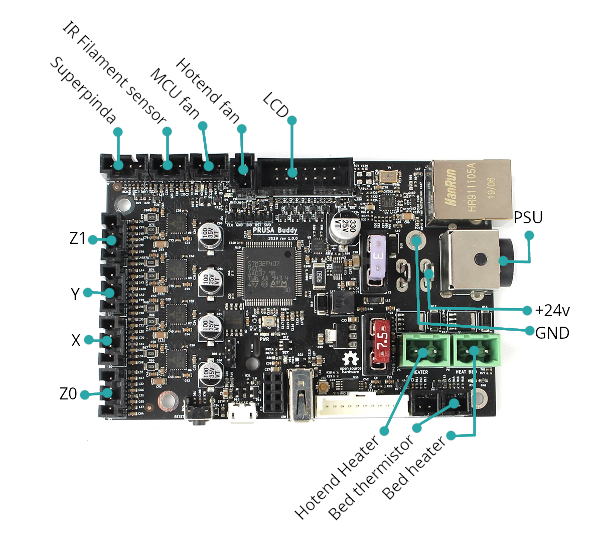
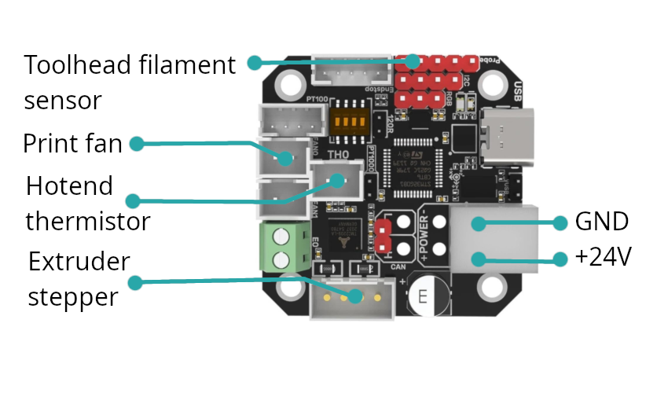
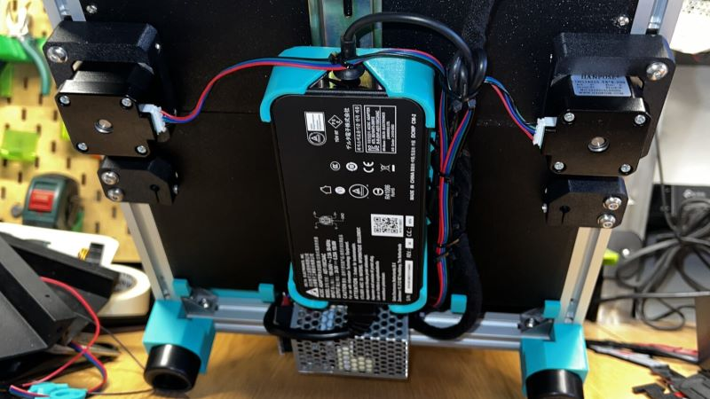
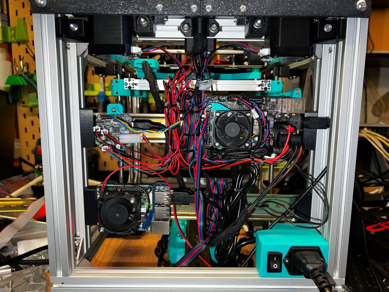

# ProosaXY Mini klipper config

## Config

A base config is provided, is the config of the ProosaXY Mini #SP00F that have the following parts

* OMC HE19 2A steppers for A/B
* Hanspose TR8x8 leadscrew steppers for Z
* BTT EBB42 1.0 MCU
* Builtin toolhead filament sensor
* TZ-V6 2.0 Hotend with 48W heater

**This config is uploaded on config section.**

If you need some help you can reach us on discord ;)

## Wiring

Take in consideration that Buddy board uses 5V on all fans/sensors, if you want to use 12/24v fans you will need to plug on different MCU

To avoid the modification of PSU wires to have +24/GND you can take it from the buddy board, we recommend to do not use the standard switch to switch on/off the board, instead of that we recomend to put IEC socket and modify a standard PSU cable, with this you can power an LRS-25-5 :)

## PSU wiring example

This is the ProosaXY Mini #SP00F

* IEC socket with master switch
* Standard IEC PSU cable wired to the MINI PSU inlet
* AC wires to the LRS-25-5 PSU
* +24v/GND from buddy board to EBB42 MCU
* +24v connection of buddy board are jumped

