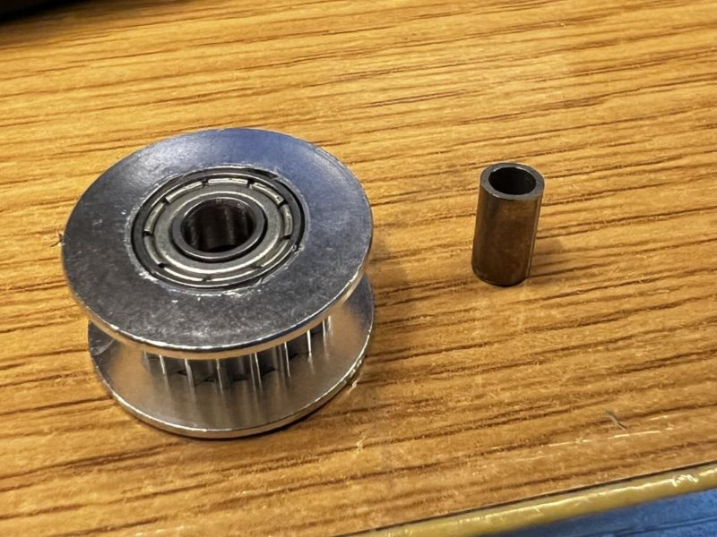
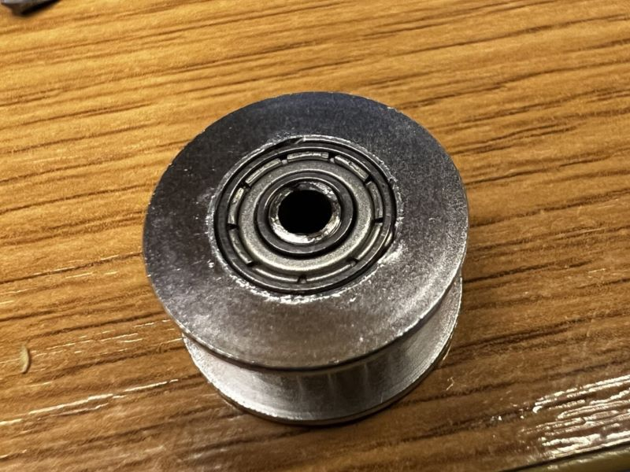
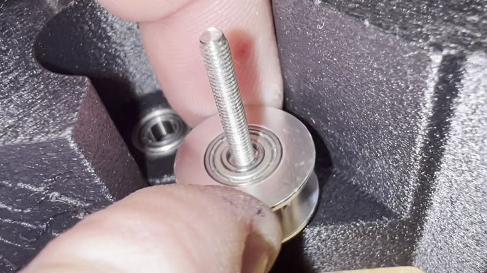

# ProosaXY MINI rear 20T idlers

To avoid a complete redesign of motor mounts we decided to made this adaptation to able to use 20T idlers with 4MM ID, that are the best because the 4MM ID ones have the bigger bearing.

We need a to put a 8.5x3x4 spacer, if you cant source one you can fabricate using a 3mm ID / 4mm OD steel tube and cut to correct lenght.

 

There is no tradeoffs on this adaptation, the bearing stays in place without any play.

The y-carrier ones are assembled with 4mm screw, no adaptatio needed on this ones.