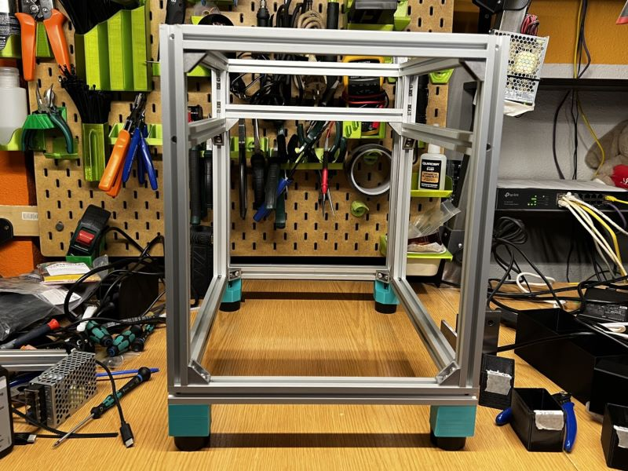
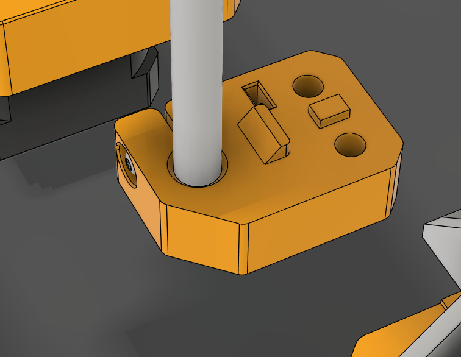
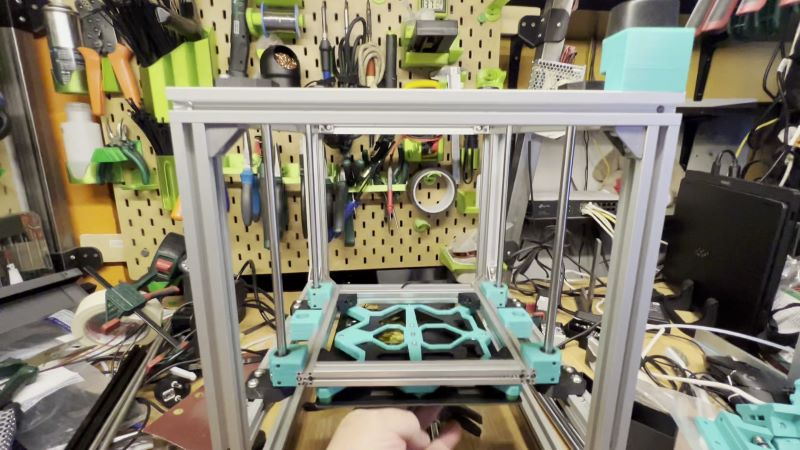

# ProosaXY MINI Z-axis assembly

The procedure it's very similar as normal ProosaXY but with different z-rod-mount-aligner, you can do this without the aligner, the distance from the extrusion to the z-rod-bottom/top-mounts are 48mm.

## 1. Procedure

Build the frame and put the feet.

Then you need to put the printer upside down and use the z-rod-mount-aligner on LEFT mounts, thats one that have this shape, and thigthen.

Then do the same on right side using the Z-rod-mount-aligner.

When the front bottom/top rod mounts are thigthened you need to push the bed to the lowest position and thigthen the lower back rod mounts, then raise the bed to the top position and thigthen the top rod mounts.

If you done that you notice the bed will move freely up/down to the maximum positions. If one bearing doesn't reach their max range positions you may have a misaligned mounts. (check the video)

Then put the Z motors in, move the bed to the lowest position and tigthen the z motor mount screws.

Use your hand to rotate the z motor to move the bed up/down, make sure there are no binding or leadscrew mis-align. Repeat the align if needed.