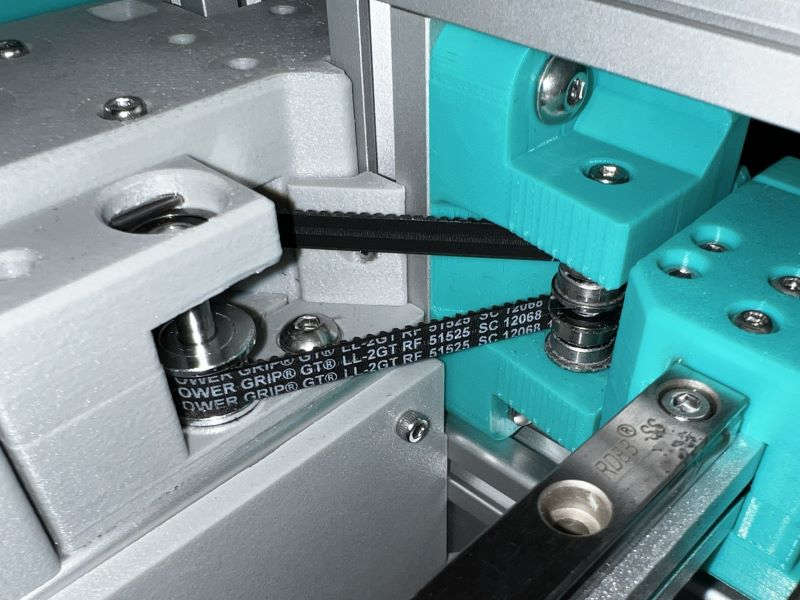
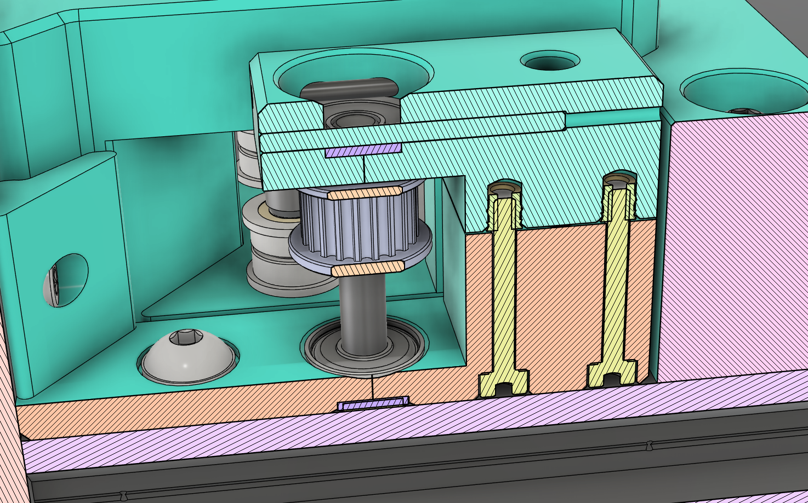
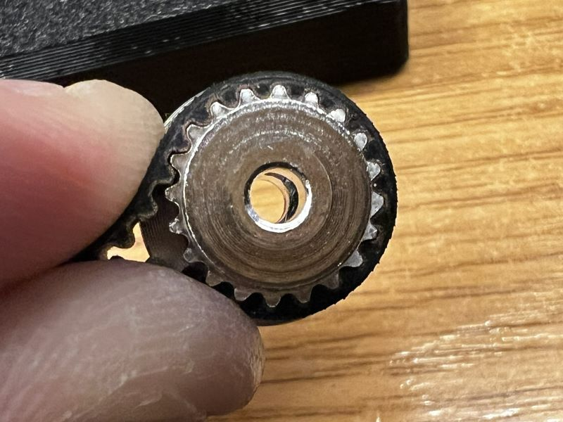
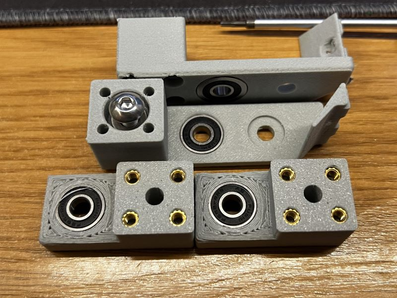
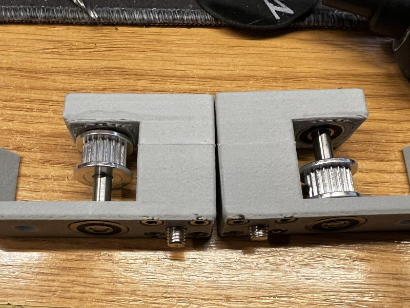
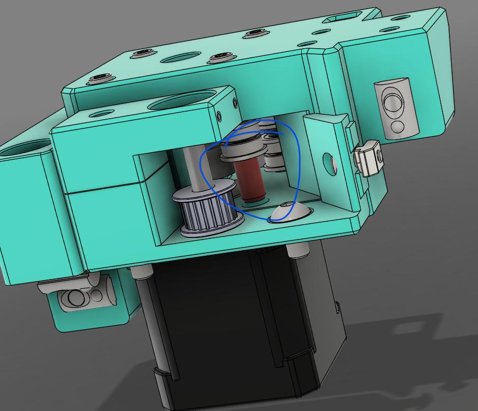

# ProosaXY Rear live idlers

## 1. Intro

This upgrade is made originally for the ProosaXY HS but can be retrofitted to Stock ProosaXY if you want to fit live idlers instead of normal idlers.

The main advantage of live idlers it's we can fit big bearings on toothed idlers. Making it suitable for high speed / accelerations.

This mod is intended to fit without reprint the motor mounts.

This live idler uses 2x30mm dowel pins to lock in place the top F695RS bearing and reinforce the printed part. the idler is mounted right in front of motor mounts, on the same extrusions.

## 2. Printing instructions

Due the stress that this part need to support it's recommended to print with carbon filled filament but not mandatory, and at least 7 walls and 7 top/bottom surfaces.

All parts comes with printable supports, no need to add your custom supports.

## 3. BOM (for two rear idlers)

| Name                 | Units | Notes                                                     |
| -------------------- | ----- | --------------------------------------------------------- |
| M3x20 SHSC           | 8     | You can fit BHSC instead, but the pocket is made for SHSC |
| M3x8 SHSC            | 2     |                                                           |
| M5x10 BHSC           | 2     |                                                           |
| M5x16 BHCS           | 2     |                                                           |
| M5x7x1 Washer        | 4     |                                                           |
| M3 2020 T-nut        | 2     |                                                           |
| M5 2020 T-nut        | 4     |                                                           |
| M3x4x4.2 Heat Insert | 8     | Stock ProosaXY heat inserts                               |
| M2x30 dowel Pin      | 4     | Can be longer if you have                                 |
| M3x30 dowel pin      | 2     | Can be longer if you have                                 |
| 20T 2GT pulley       | 2     | Check the next section for details                        |
| F695RS Bearings      | 4     | Flanged bearings                                          |

## 4. 20T 2GT Pulley

TLDR: You can use whatever you want if have 5MM ID

Because we have room we let the posibility of you can fit whatever you want, even a 16T Pulley, this is not tested, if you test ping us on discord :).

Our recomendation is to use AF Type Pulleys, to save money, you dont need to dehub good 20T pulleys, you can fit as is without dehub.

Along it meet the 2GT belt cut it's good to go.

If you plan to fit the MGN9H X axis mod we encourage to buy AF type pulleys, because on the carriers you can't fit no-dehub pulleys

## 5. Assembly

The design takes in consideration that it's very difficult to have perfect sized small holes, and it's very difficult to have a "universal" clearance for 2mm holes that needs to be perfect to 2mm.

You need to bore up the holes for the 2mm dowel pins ensure smooth operation. If not you will have some difficulties to remove the dowel pins if needed.

The M3x8 screw is only ensure the printed part is centered and put in their correct position, no need to thighten fully, the only screws that need to be thigten fully are the M5 ones, if you notice the idler doesn't run smooth you need to loose a bit the M3x8 extrusion screw.

The F695RS is press fit on both sides. On top is fixed in place using the two dowel pins, on the bottom place is fixed in place when mounted on the extrusion.

Assemble both parts (bottom and top) with the M5x16 + M5 washer inside. The left pulley is on top, the right pulley on bottom place, you can fix in place if you want, if your pulley has screws thigten and put threadlocker if your pulley is pressfit you can use loctite 648 to fix in place.

Do not forget to remove the 16T idlers of motor mounts and replace it with the printed spacers. You need to print this specific spacers, need to be thin to allow the belt pass without grinding.

