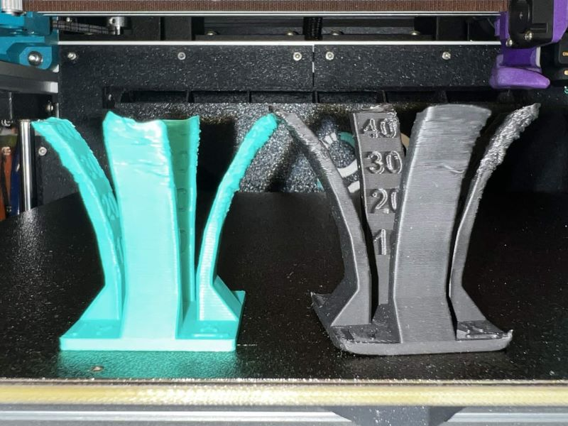
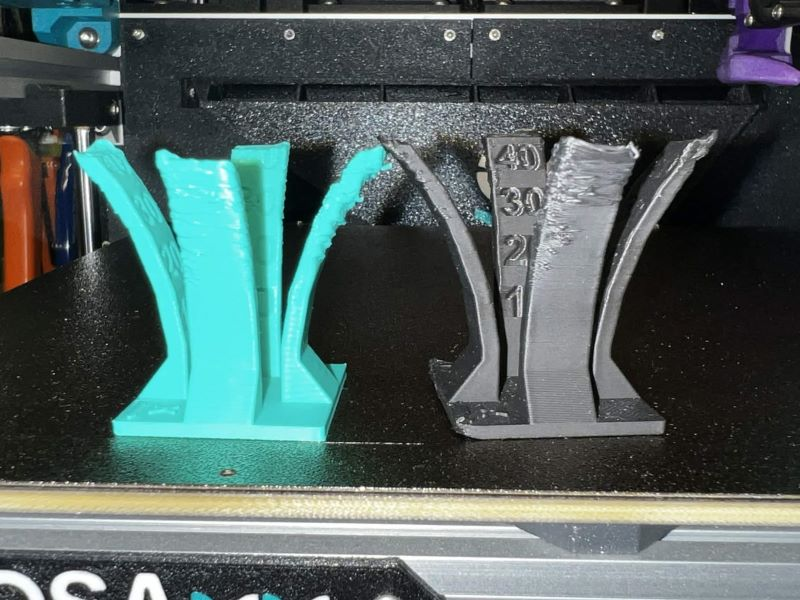
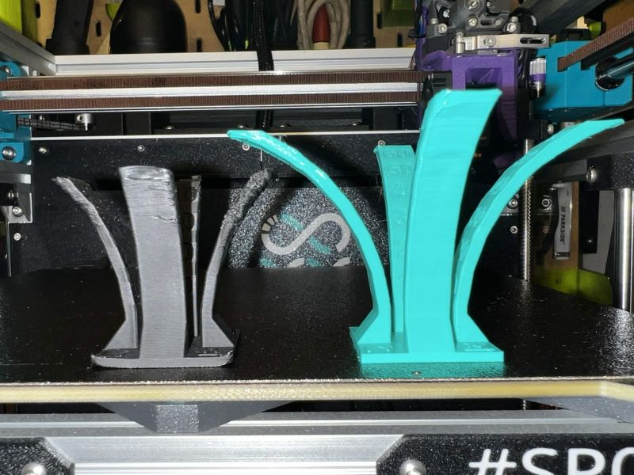
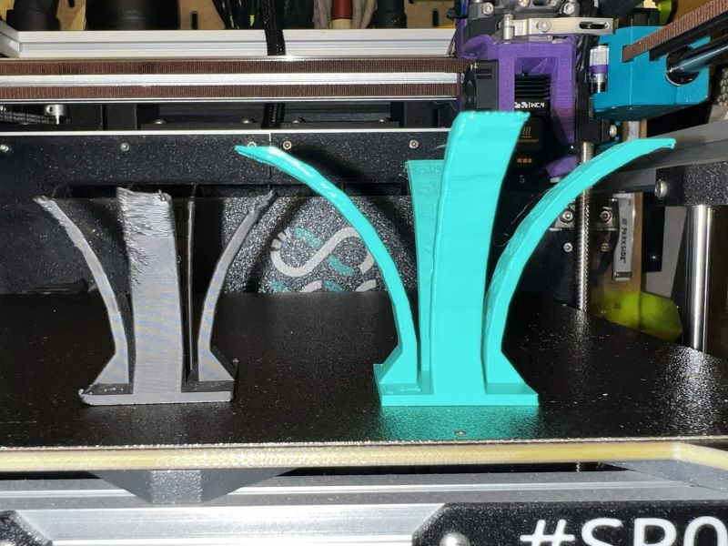
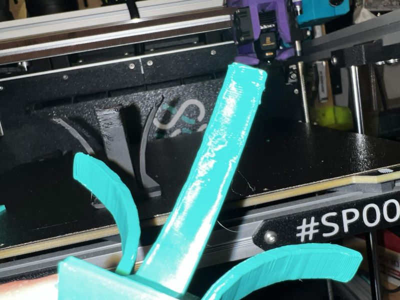
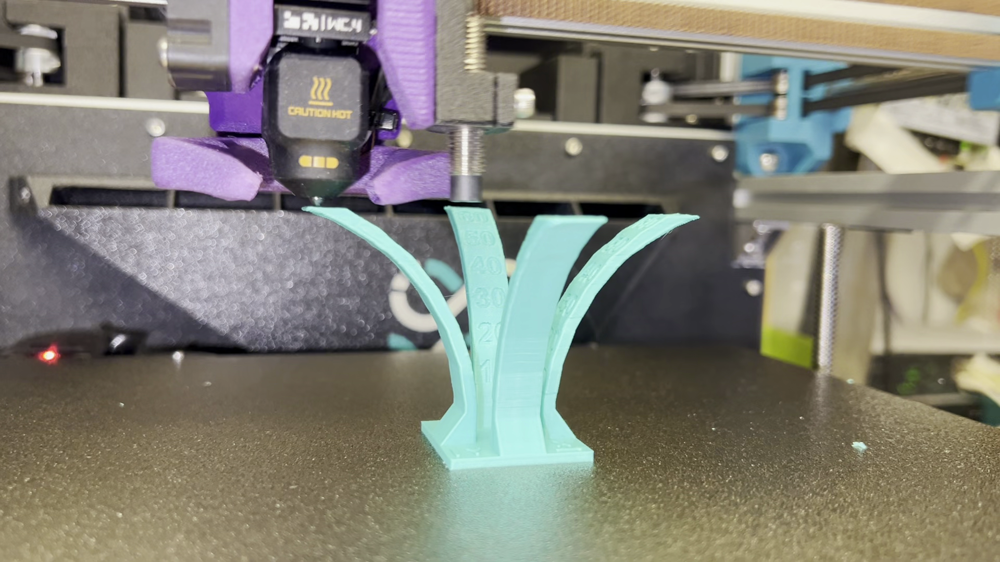
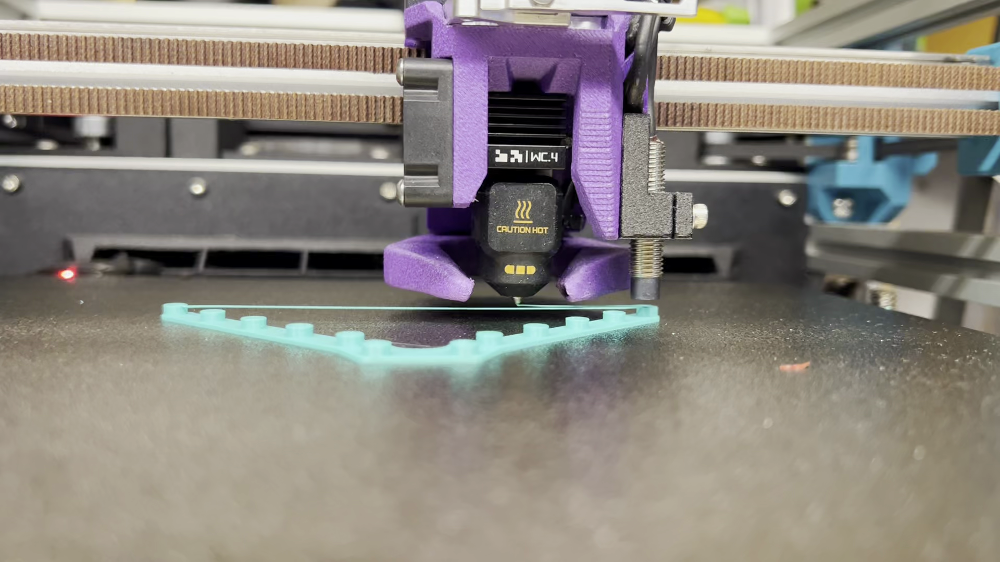

# Upgraded fan duct

This is a upgraded version of the fan duct.

The standard one of the Proosa it's a bit weak, work with standard 5015 fan of prusa but doesn't perfom very well on high pressure/flow 5015.

There is the comparison between the Standard proosa duct and alpha version of the new duct (variation of tri-horn of eva)

All test were made with the same brand of PLA, 230ºC and Proosa Mini / Proosa HS std profile with min layer time removed (1s) and no z-hop, The fan it's the same, GSD Time 8500RPM at 100%

We have a improvement but not much.

With the new beta fan duct the improvement is massive. Almost finished the test, with more layer time will finished the test, but the nozzle deatached the printed part from the bed because hits curled edges.

Video showing the nozzle hitting the printed part.

Even the bridging improved a lot (video bridging)

