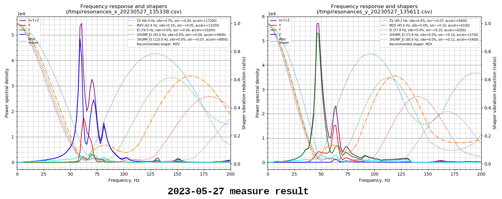
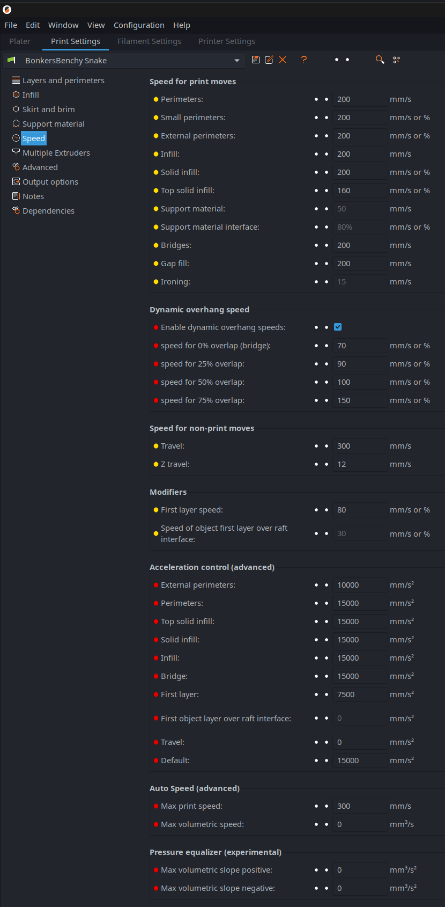
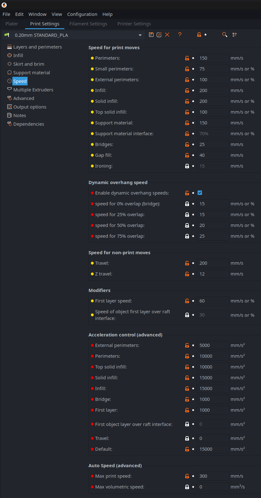
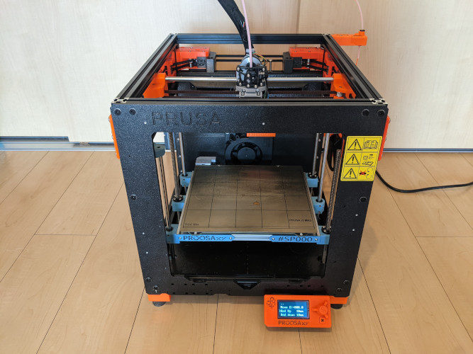
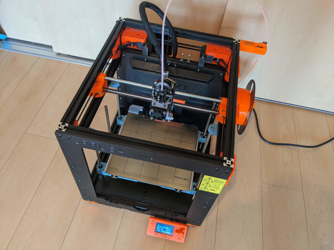
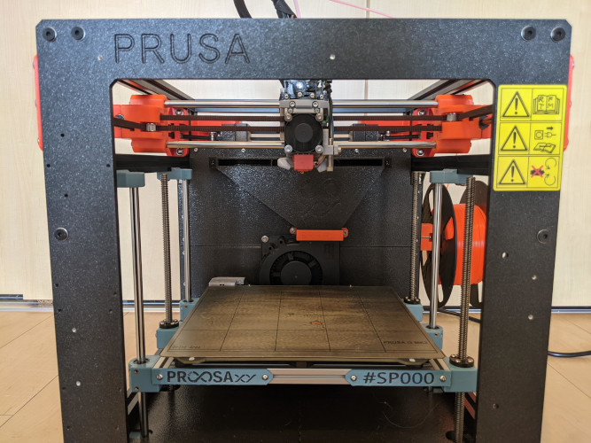
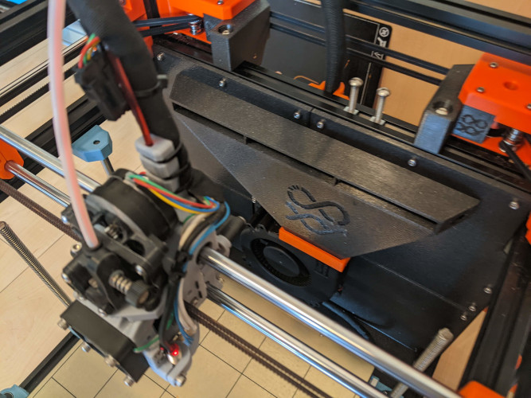
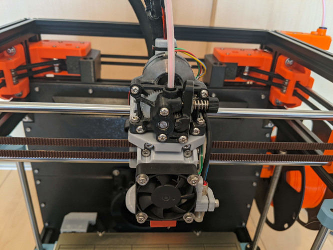
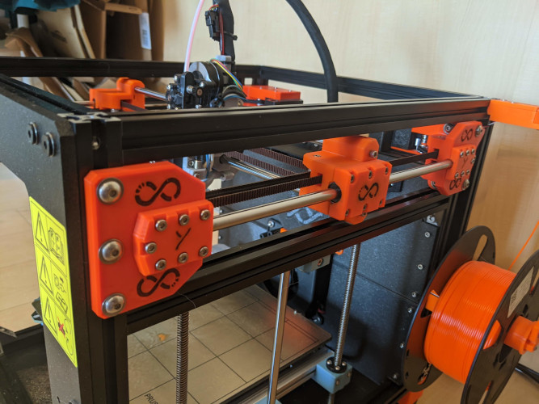
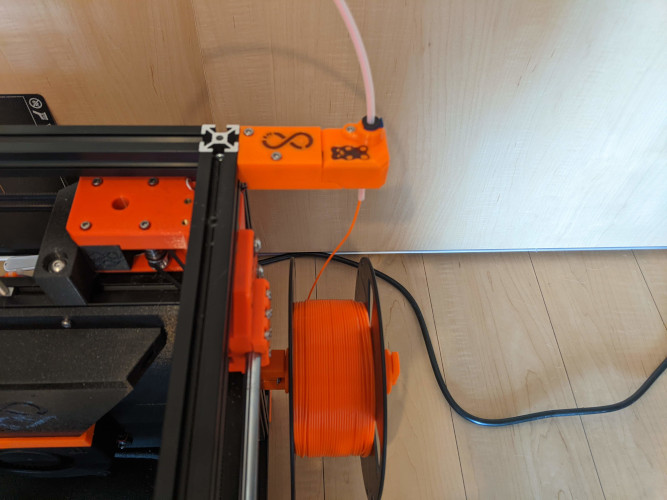

# ProosaXY
CoreXY conversion for Prusa MK3/S. This build is aiming at getting more performance out of your 6 years old machine with the lowest cost possible by re-using most the MK3/S stock parts.

## 1. Features

- Better performance (check input-shaper graph bellow)
- Semi-enclosure by default
- ~~Dual z axis(default) or independent tripple Z axis(Optional)~~ Triple Z (independent or sync based on controller board) by default or dual Z(optional)
- Single v6 hotend(default) or mixed 2-in-1-out hotend(WIP)
- Optional AUX cooling fan
- Our industrial leading SnakeOil technology

## 2. Status

- All the main parts design are completed. Test print result are posted in our [Discord server](https://discord.gg/WZVP2HuAag)
- ~~The first beta is planned to release at the end of May.~~ I'm a little late. Will take me a few extra weeks to work on the BOM and the CAD assembly.
- Might take a month or two for us to complete design all the optional parts. 
- For updates, please visit our [Discord server](https://discord.gg/WZVP2HuAag)

- The input-shaper calibration is quite good for an 8mm shaft machine, in my opinion. We have a recommended acceleration of about 6000 mm/s2 (which should be used as the limit for outer perimeter acceleration), and a higher maximum acceleration/speed, depending on how fast your motor can run.
- For some extra speed boost, check my [slicer plugin](https://github.com/SnakeOilXY/klipper-dynamic-scv-slicer-post-processing) (klipper firmware only)

## 3. Warning - read this

- This mod requires some drilling on the original frame, cutting the original motor leadscrew, and linear shafts. This drilling/cutting is easy enough to be done with a hand drill and a hacksaw **BUT THERE IS NO WAY BACK. You won't be able to convert back to the original MK3/s machine if you change your mind later.**
- Some small changes/patches might be needed after I have more test data and feedback..
- To keep the cost down and reuse old components, there are some trade-offs I made:
    - The machine is semi-enclosed by default and will need some printed panels and a top hats to fully enclose it.
    - To match the frame height, cutting the motor leadscrew and linear shafts is required.
## BOM
[>>> Bill of materials (work in progress) <<<](./doc/BOM/readme.md)

## 4. Test run videos and images

### 4.1 Prusa Mk4 12mins bonker benchy 

<table>
    <thead>
        <tr>
            <th></th>
            <th align="center">Mk4 bonker benchy</th>
            <th align="center">SpeedBoatRace</th>
            <th align="center">Slow benchy</th>
        </tr>
    </thead>
    <tbody>
        <tr>
            <td>Video</td>
            <td align="center"></td>
            <td align="center"></td>
            <td align="center"><a href="https://youtu.be/kLawpgAUUPE" rel="nofollow">
        </tr>
        <tr>
            <td>Description</td>
            <td>I use the setting Prusa used on their mk4 12 mins benchy with accel pump up a little.</td>
            <td></img></td>
        </tr>
    </tbody>
</table>

[Video link]()  
[Print result](./doc/img/bonker-benchy/)

### 4.2 Realworld print speed.

### 4.3 Images

