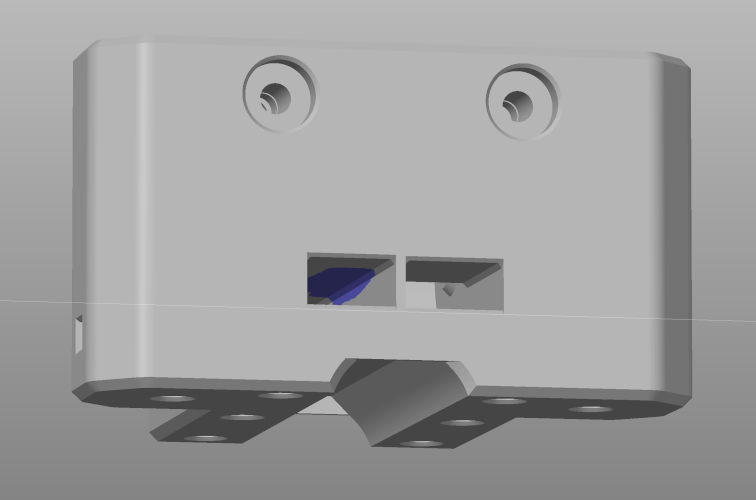

# Print setting

## 1.Slicer config

- This is the setting I'm using but any other settings will work as long as the parts are strong enough.
- All STLs are oriented. (Please report if you find problem)
- Make sure your printer well calibrated.

<pre>Layer height : 0.2mm
Wall count : 5
Top/bottom layer : 5
Infill : 30% Gyroid 
Outer wall line width : 0.4mm
Inner wall line width : 0.45mm
Infill line width : 0.5mm
Most of the parts are designed to be printed without support(for exception, check the list bellow). You can enable "support on build plate only" for better overhang surface.
</pre>

### Parts require custom support

|   |   |   |
|---|---|---|
| 3x_pom-nut-mounter.stl |   | Need support on build plate |
| 2x_y-carrier_***.stl |  | Custom support inside the channel due to some thin walls. |
|   |   |   |

## 2.Filament

- PETG and higher temp-resistant filaments will work.
- Motor mount and tool head parts might require higher temp-resistant filament.
- Gillter or CF filled filaments might make the parts more brittle or creep.

