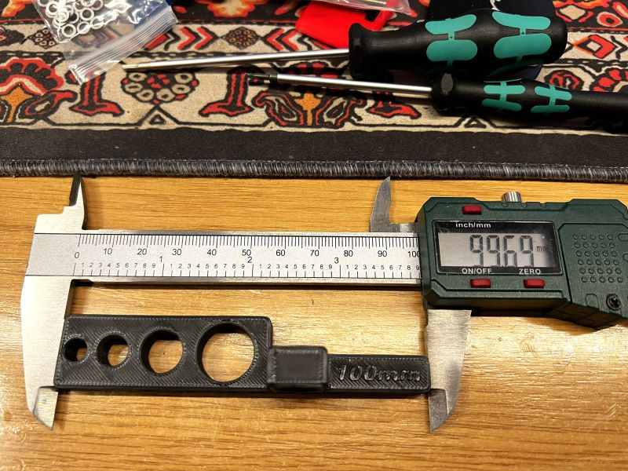
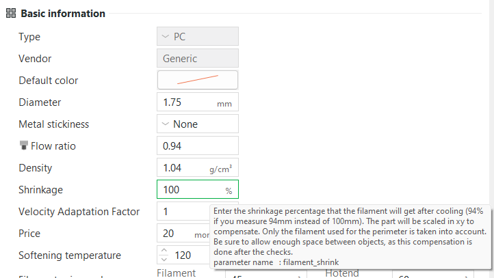
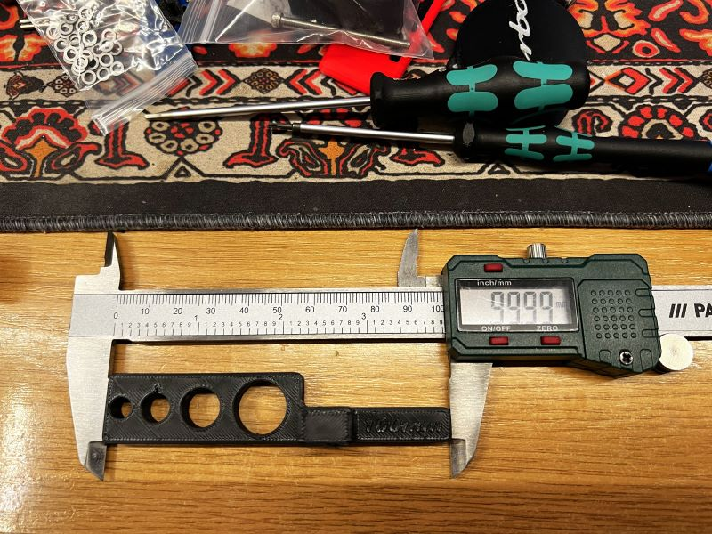
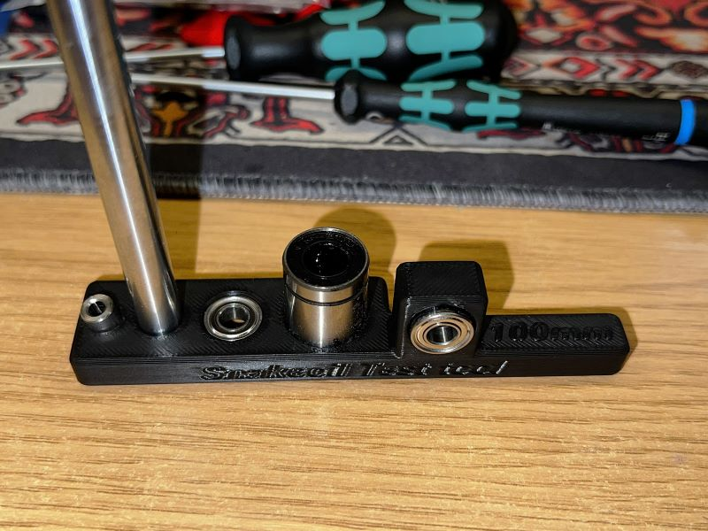

# Snakeoil Test tool

We developed a test tool to ensure a correct printing of the printed parts.

Some parts require to insert a bearing, a smooth rod, etc...

It's under STLs/tools/

Today we have a very well tuned profiles by the manufacturers, but most of them do not tune the shrinkage ratio, this is very important, even PLA Shrink.

You need to have a proper flow calibration and pressure advance.

You have a very good manuals here from Ellis. [PA Calibration](https://ellis3dp.com/Print-Tuning-Guide/articles/pressure_linear_advance/tower_method.html) and [Flow calibration](https://ellis3dp.com/Print-Tuning-Guide/articles/extrusion_multiplier.html)

With this test you will calibrate the shrink ratio

Just print with your normal profile, using 3-4 perimeters, this is important due we need to test if your profile overheat and do poor overhangs.

Leave cool at least 20 minutes and measure the printed piece, you will notice the printer part will not meet the 100mm lenght

Don't worry about that, this is the expected without the shrink ratio configured.

Now we pick these values and we are going to fill the shrink ratio / shrink compensation under filament configuration of our slicer.

With my example you will input 99.69% on shrinkage.

Reprint the part.

Now the expected is the printed part will meet the 100mm+-0.01mm

From left to right the holes are intended to test.

* Bed spacer (helper), very hard to push into, is expected, to avoid to fall off
* 8mm smooth rod
* MR115 Bearing
* LM8UU Bearing
* MR115 Bearing (vertical one)
* M5 screw (vertical one)

Some videos.

[Snakeoil test tool demostration video](https://www.youtube.com/watch?v=dke0h-PXOAI)
[ProosaXY Mini printing snakeoil test tool](https://www.youtube.com/watch?v=qTiXc0uOBks)
